# Arduino 教程

## Arduino软件安装，安装Pico开发板及上传Pico固件

1.安装Windows驱动程序

### 1.1.下载安装arduino软件： 

（1）首先，进入arduino官方网站：[<u>https://www.arduino.cc/</u>](https://www.arduino.cc/)
，点击“SOFTWARE”进入下载页面，如下图所示：

（2）然后，根据你的操作系统选择并下载相应的安装程序。如果你是Windows用户，请选择“Windows安装程序”下载正确的安装驱动程序。

选择点击Windows Win7 and newer下载Arduino 1.8.16版本的安装程序，需要手动安装。而当点击Windows ZIP file时，Arduino 1.8.16版本的zip文件将被直接下载，只需要解压缩它就可以完成安装。

一般情况下，点击JUST DOWNLOAD就可以下载了，当然如果你愿意，你可以选择小小的赞助，以帮助伟大的Arduino开源事业。

（3）Arduino软件下载完成后，继续安装，当你收到操作系统的警告时，请允许驱动程序安装。首先点击I Agree, 然后选择好要安装的组件后再点击Next。

（4）选择安装目录(我们建议保持默认目录)，然后点击Install。

（5）如果出现以下界面，则应选择Install。

该过程将提取并安装所有必需的文件，以正确执行Arduino软件(IDE)。

安装完成后，会在桌面上生成一个Arduino 软件快捷方式。

在电脑桌面上点击Arduino 软件快捷方式打开Arduino IDE.

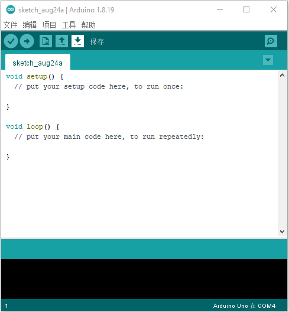

点击“File”→“Preferences”，选择“简体中文”之后点击“好”。这样就对语言进行设置好了。

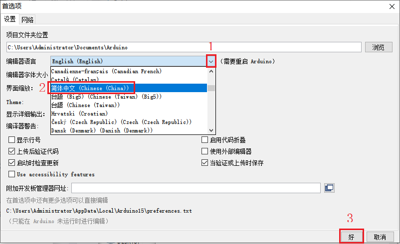

关掉Arduino IDE，重新点击Arduino 软件快捷方式打开Arduino IDE。这样，英文页面就转化成中文页面。

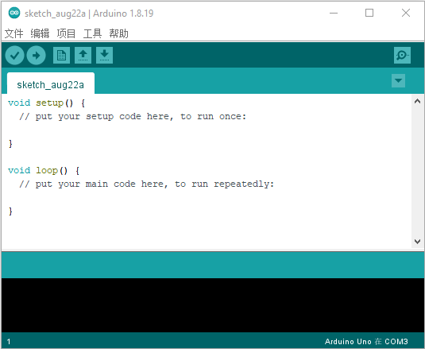

A - 用于检查是否存在任何编译错误。

B - 用于将程序上传到Arduino控制板。

C - 用于创建新草图的快捷方式。

D - 用于直接打开示例草图之一。

E - 用于保存草图。

F - 用于从板接收串行数据并将串行数据发送到板的串行监视器。

### 1.2.安装开发板Pico 

（1）网络连接良好的情况下，打开Arduino IDE，单击“工具”→“开发板”→“开发板管理器...”。

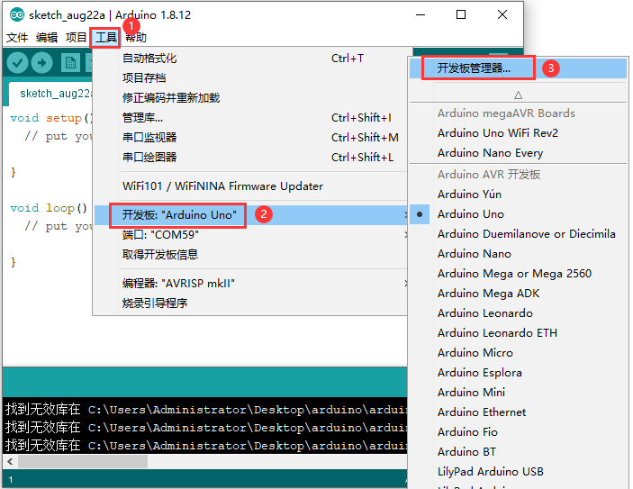

2.  在搜索框中输入Pico，选择Arduino Mbed OS RP2040     Boards，点击安装或更新。

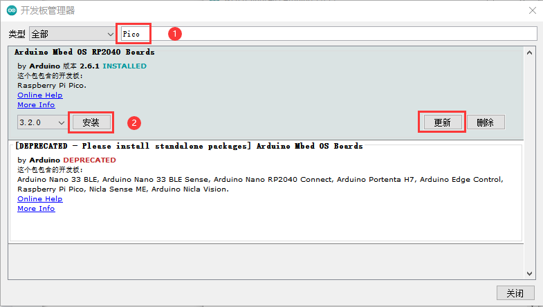

（3）安装过程中，当你收到操作系统的安全警告时，请单击安装允许设备软件安装。

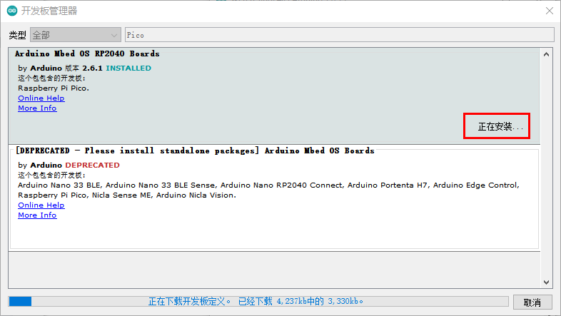

（4）安装完成后，单击关闭就可以了。

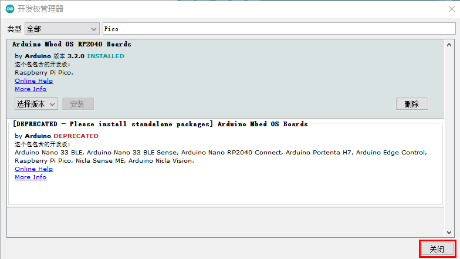

### 1.3.上传Arduino兼容的Pico固件 

如果你的树莓派Pico板是新的，想使用Arduino学习和开发，则需要上传一个Adruino兼容的Pico固件。请参考以下步骤配置:

（1）断开树莓派Pico板与电脑的连接。继续按树莓派Pico板上的白色按钮(BOOTSEL)，并在松开按钮前将树莓派Pico板连接到电脑。(注意：MicroUSB线连接到树莓派Pico板前一定要一直按住按钮，否则固件下载不会成功)

（2）打开Arduino IDE，单击 文件→示例→01.Basics→Blink。

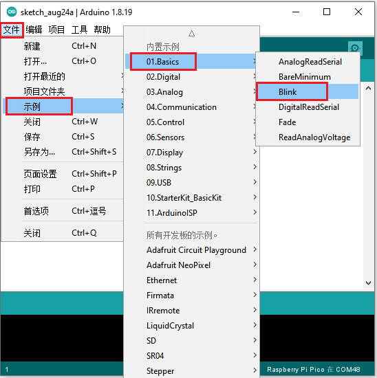

（3）单击工具→开发板:→Arduino Mbed OS RP2040 Boards→Raspberry Pi Pico。

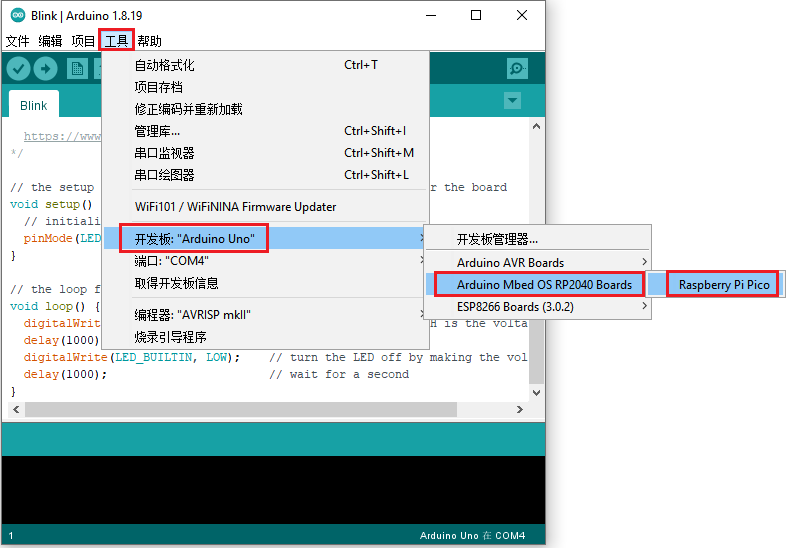

（4）上传草图（Blink）到 Raspberry Pi Pico。

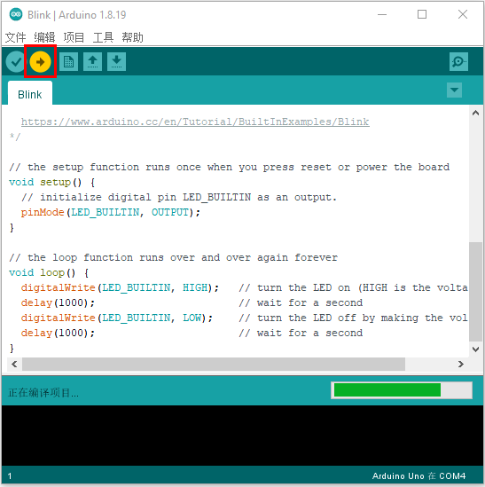

当草图完成上传时，可以看到以下提示。

树莓派Pico板上的指示灯开始闪烁。

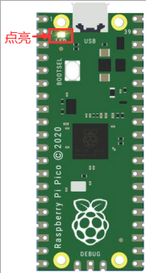

1秒

单击工具→端口→COMx(Raspberry Pi Pico)。COMx的X在不同的电脑上是不同的。请在你的电脑上选择正确的COM口。在这个的例子中，它是COM15。

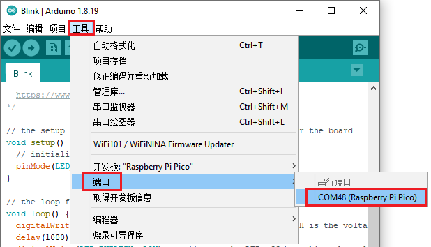

注意:

1.  第一次使用Arduino上传Raspberry Pi     Pico的草图时，不需要选择端口。之后，每次上传草图前，请检查端口是否已选择;否则可能导致代码上传失败。

2.  有时在使用时，Raspberry Pi     Pico可能会由于代码丢失固件而无法工作。此时，你可以如上所述步骤上传Raspberry     Pi Pico的固件。

2.  安装MAC驱动程序

### 2.1.下载安装Arduino IDE: 

接下来的操作类似于Windows系统，可以参考上面的Windows系统操作过程。

## 项目教程

### 项目 01: Hello World

项目介绍：

对于树莓派Pico初学者，我们将从一些简单的东西开始。在这个项目中，您只需要一个树莓派Pico板和USB线来完成“Hello World!”项目。它不仅是树莓派Pico板和PC的通信测试，也是树莓派Pico板的初级项目。

项目元件：

|||
|-|-|
|树莓派Pico板*1|USB 线*1|

项目接线：

在本项目中，我们通过USB线将树莓派Pico板和电脑连接起来。

项目代码：

在上传项目代码到树莓派Pico板之前，请检查Arduino IDE的配置。

单击“工具”，确认板型和端口如下所示：

单击将项目代码上传到树莓派Pico板。

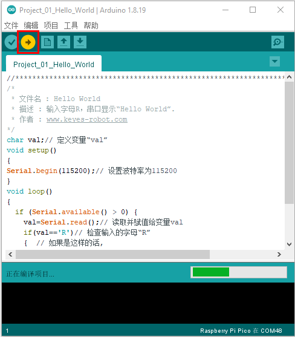

项目代码上传成功！

项目结果：

项目代码上传成功后，单击图标进入串行监视器，设置波特率为115200，在文本框输入字母“R”，单击“Send”，这样串口监视器打印“Hello World!”。

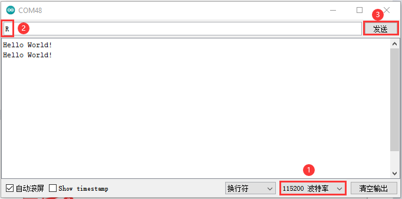

### 项目 02：板载灯闪烁

项目介绍：

树莓派Pico板上有个板载LED，这个LED是固定接在树莓派Pico板上的GP25引脚，在这个项目中，我们将来学习使板载LED闪烁。

项目元件：

|||
|-|-|
|树莓派Pico板*1|USB 线*1|

项目接线：

在本项目中，我们通过USB线将树莓派Pico板和电脑连接起来

项目代码：

树莓派Pico板上的板载LED是由GP25控制，当GP25输出高电平时，LED点亮;当输出低时，LED灯关闭。

在上传项目代码到树莓派Pico板之前，请检查Arduino IDE的配置。

单击“工具”，确认板型和端口如下所示：

单击将项目代码上传到树莓派Pico板。

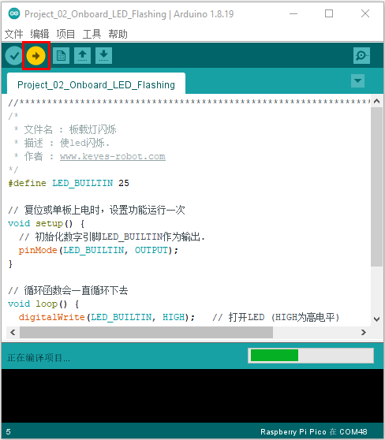

项目代码上传成功！

项目结果：

项目代码上传成功后，利用USB线上电，可以看到的现象是：树莓派Pico板的LED开始闪烁，循环进行。

1秒

### 项目 03：外接灯闪烁 

项目介绍：

在这个项目中，我们将向你展示外接LED闪烁效果。我们使用树莓派Pico板的数字引脚打开LED，让它闪烁。

项目元件：

|||||
|-|-|-|-|
|树莓派Pico板*1|树莓派Pico板的扩展板*1|公对母杜邦线若干|USB 线*1|
|||||
|红色LED*1|220Ω电阻*1|面包板*1||

元件知识：

（1）LED:

LED是一种被称为“发光二极管”的半导体，是一种由半导体材料(硅、硒、锗等)制成的电子器件。它有正极和负极。短腿为负极，接GND，长腿为正极，接3.3V或5V。

（2）五色环电阻

电阻是电路中限制或调节电流流动的电子元件。左边是电阻器的外观，右边是电阻在电路中表示的符号。电阻(R)的单位为欧姆(Ω)，1 mΩ= 1000 kΩ，1kΩ= 1000Ω。

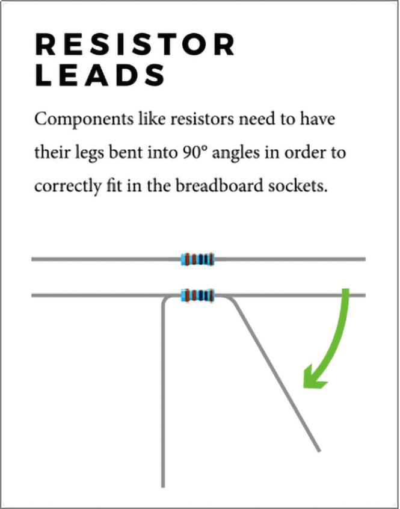

我们可以使用电阻来保护敏感组件，如LED。电阻的强度（以Ω为单位）用小色环标记在电阻器的主体上。每种颜色代表一个数字，你可以用电阻对照卡查找。

\-色带1 – 1st Digit.

-色带 2 – 2nd Digit.

-色带 3 – 3rd Digit.

-色带 4 – Multiplier.

-色带 5 – Tolerance.

在这个套件中，我们提供了3个具有不同电阻值的五色环电阻。这里以3个五色环电阻为例：

220Ω 电阻*10

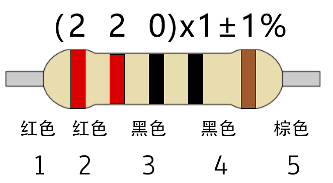

10KΩ 电阻*10

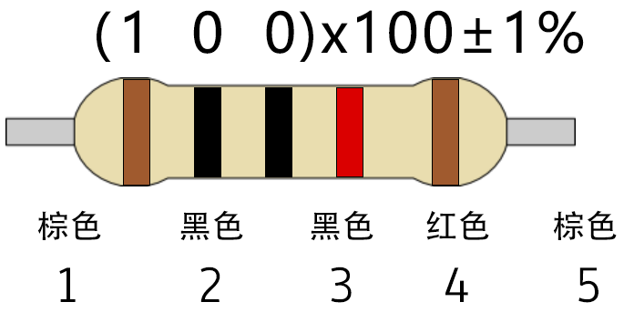

1KΩ 电阻*10

在相同的电压下，会有更小的电流和更大的电阻。电流(I)、电压(U)、电阻(R)之间的联系可以用公式表示：I=U/R。在下图中，假如电压为3V，则通过R1的电流:
I = U / R = 3 V / 10 KΩ= 0.0003A= 0.3mA。

不要把电阻值很低的电阻直接连接在电源两极，这样会使电流过高而损坏电子元件。电阻是没有正负极之分。

（3）面包板

面包板是实验室中用于搭接电路的重要工具。面包板上有许多孔，可以插入集成电路和电阻等电路元件。熟练掌握面包板的使用方法是提高实验效率，减少实验故障出现几率的重要基础之一。下面就面包板的结构和使用方法做简单介绍。一个典型的面包板如下所示：

面包板的外观和内部结构如上图所示，常见的最小单元面包板分上、中、下三部分，上面和下面部分一般是由一行或两行的插孔构成的窄条，中间部分是由中间一条隔离凹槽和上下各5
行的插孔构成的条。

在面包板的两个窄条分别有两行插孔，两行之间是不连通的，一般是作为电源引入的通路。上方第一行标有“+”的一行有10组插孔（内部都是连通），均为正极；上方第二行标有“-”的一行有10组插孔，（内部都是连通），均为接地。面包板下方的第一行与第二行结构同上。如需用到整个面包板，通常将“+”与“+”用导线连接起来，“-”与“-”用导线连接起来。

　　中间部分宽条是由中间一条隔离凹槽和上下各5
行的插孔构成。在同一列中的5
个插孔是互相连通的，列和列之间以及凹槽上下部分则是不连通的。外观及结构如下图：

中间部分宽条的连接孔分为上下两部分，是面包板的主工作区，用来插接原件和跳线。在同一列中的5个插孔（即a-b-c-d-e，f-g-h-i-j）是互相连通的；列和列之间以及凹槽上下部分是不连通的。在做实验的时候，通常是使用两窄一宽组成的小单元，在宽条部分搭接电路的主体部分，上面的窄条取一行做电源，下面的窄条取一行做接地。中间宽条用于连接电路，由于凹槽上下是不连通的，所以集成块一般跨插在凹槽上。

（4）keyes 树莓派Pico板的扩展板使用方法

将树莓派Pico板堆叠在扩展板上即可使用，如下图：

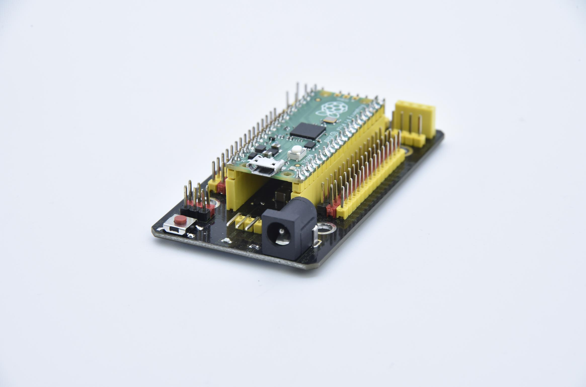

（5）电源

在本项目中，我们用USB线将Raspberry Pi Pico和电脑连起来。连接方法请参照文档：开发环境设置

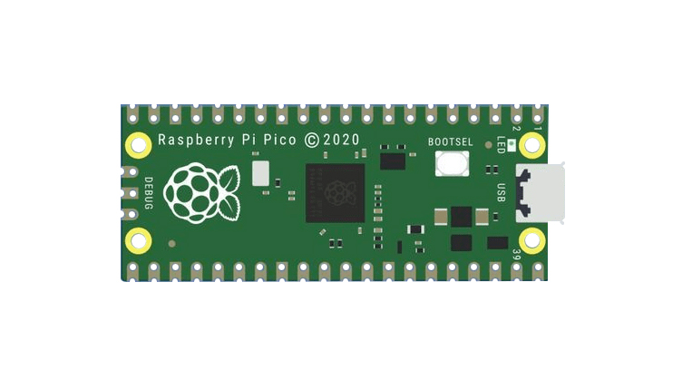

项目电路图和接线图：

首先，切断树莓派Pico板的所有电源。然后根据电路图和接线图搭建电路。电路搭建好并验证无误后，用USB线将树莓派Pico板连接到电脑上。注意：避免任何可能的短路(特别是连接3.3V和GND)!

警告：短路可能导致电路中产生大电流，造成元件过热，并对硬件造成永久性损坏。

电路图

接线图

注意:

怎样连接LED

怎样识别五色环220Ω电阻

项目代码：

根据电路图，当树莓派Pico板的GP16输出高电平时，LED点亮；当输出低电平时，LED灯关闭。因此，我们可以通过控制GP16重复输出高低电平，使LED反复闪烁。

在上传项目代码到树莓派Pico板之前，请检查Arduino IDE的配置。

单击“工具”，确认板型和端口如下所示：

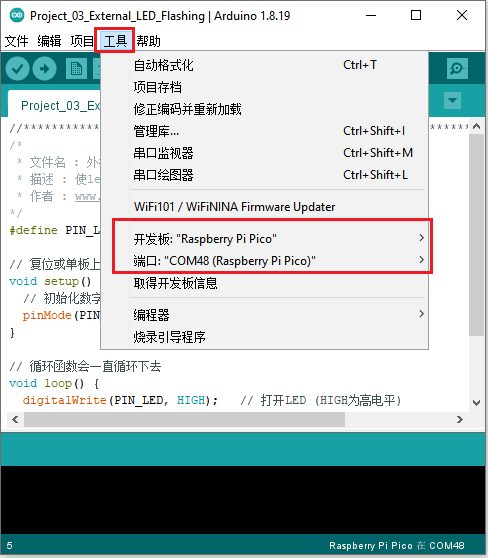

单击将项目代码上传到树莓派Pico板。

项目代码上传成功！

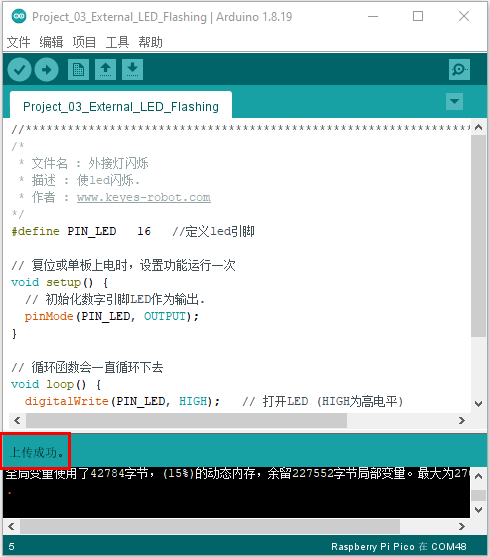

项目结果：

项目代码上传成功后，利用USB线上电，可以看到的现象是：电路中的LED开始闪烁，循环进行。

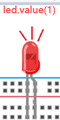

5秒

### 项目 04：呼吸灯

项目介绍：

在之前的研究中，我们知道LED有亮/灭状态，那么如何进入中间状态呢?如何输出一个中间状态让LED“半亮”?这就是我们将要学习的。呼吸灯，即LED由灭到亮，再由亮到灭，就像“呼吸”一样。那么，如何控制LED的亮度呢?我们将使用树莓派Pico板的PWM来实现这个目标。

项目元件：

|||||
|-|-|-|-|
|树莓派Pico板*1|树莓派Pico板的扩展板*1|公对母杜邦线若干|USB 线*1|
|||||
|红色LED*1|220Ω电阻*1|面包板*1||

元件知识：

Analog & Digital

模拟信号在时间和数值上都是连续的信号。相反，数字信号或离散时间信号是由一系列数字组成的时间序列。生活中的大多数信号都是模拟信号。一个熟悉的模拟信号的例子是，全天的温度是如何不断变化的，而不是突然从0到10的瞬间变化。然而，数字信号的值可以瞬间改变，这个变化用数字表示为1和0(二进制代码的基础)。如下图所示，我们可以更容易地看出它们的差异。

在实际应用中，我们经常使用二进制作为数字信号，即一系列的0和1。由于二进制信号只有两个值(0或1)，因此具有很大的稳定性和可靠性。最后，可以将模拟信号和数字信号相互转换。

PWM：

脉宽调制(PWM)是一种利用数字信号控制模拟电路的有效方法。普通处理器不能直接输出模拟信号。PWM技术使这种转换(将数字信号转换为模拟信号)非常方便。PWM技术利用数字引脚发送一定频率的方波，即高电平和低电平的输出，交替持续一段时间。每一组高电平和低电平的总时间一般是固定的，称为周期(注:周期的倒数是频率)。高电平输出的时间通常称为脉宽，占空比是脉宽(PW)与波形总周期(T)之比的百分比。高电平输出持续时间越长，占空比越长，模拟信号中相应的电压也就越高。下图显示了对应于脉冲宽度0%-100的模拟信号电压在0V-3.3V(高电平为3.3V)之间的变化情况.

PWM占空比越长，输出功率越高。既然我们了解了这种关系，我们就可以用PWM来控制LED的亮度或直流电机的速度等等。从上面可以看出，PWM并不是真实的模拟信号，电压的有效值等于相应的模拟信号。因此，我们可以控制LED和其他输出模块的输出功率，以达到不同的效果

树莓派Pico板与 PWM

树莓派Pico板有16个PWM通道，每个PWM通道可以独立控制频率和占空比，时钟频率范围为7Hz到125MHz。树莓派Pico板上的每个引脚都可以配置为PWM输出。

项目电路图和接线图：

项目代码：

本项目设计使GP16输出PWM，脉宽由0%逐渐增加到100%，再由100%逐渐减小到0%。

在上传项目代码到树莓派Pico板之前，请检查Arduino IDE的配置。

单击“工具”，确认板型和端口如下所示：

单击将项目代码上传到树莓派Pico板。

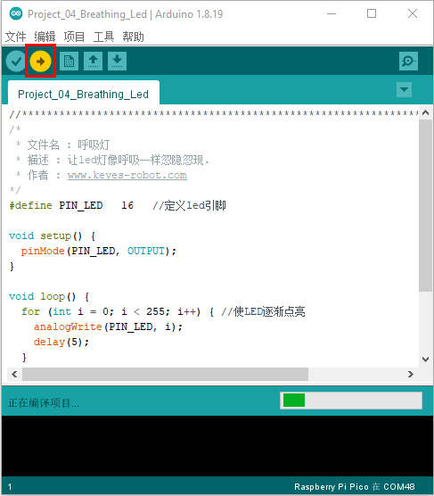

项目代码上传成功！

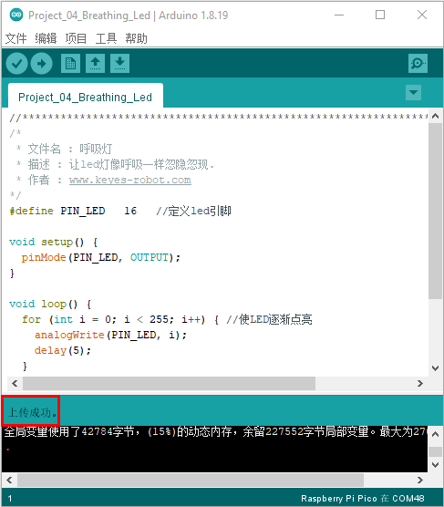

项目现象：

项目代码上传成功后，利用USB线上电，可以看到的现象是：电路中的LED从暗逐渐变亮，再从亮逐渐变暗，就像呼吸一样，循环进行。

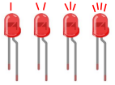
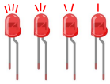

### 项目 05：交通灯

项目介绍：

交通灯在我们的日常生活中很普遍。根据一定的时间规律，交通灯是由红、黄、绿三种颜色组成的。每个人都应该遵守交通规则，这可以避免许多交通事故。在这个项目中，我们将使用树莓派Pico板和一些led(红，黄，绿)来模拟交通灯。

项目元件：

||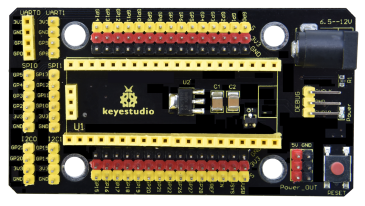||||
|-|-|-|-|-|
|树莓派Pico板*1|树莓派Pico板的扩展板*1|公对母杜邦线若干|红色LED*1|黄色 LED*1|
|||||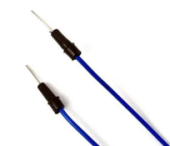|
|绿色LED*1|USB 线*1|220Ω电阻*3|面包板*1|跳线若干|

项目电路图和接线图：

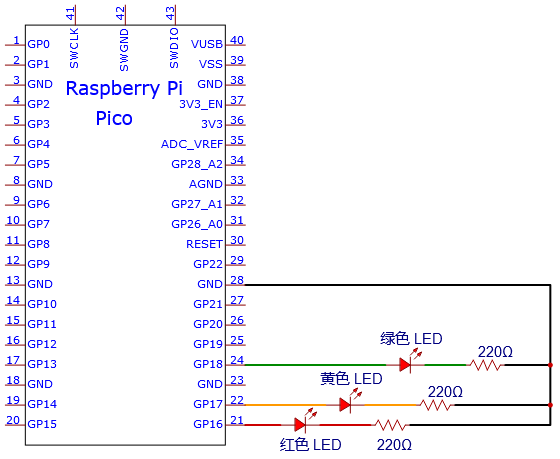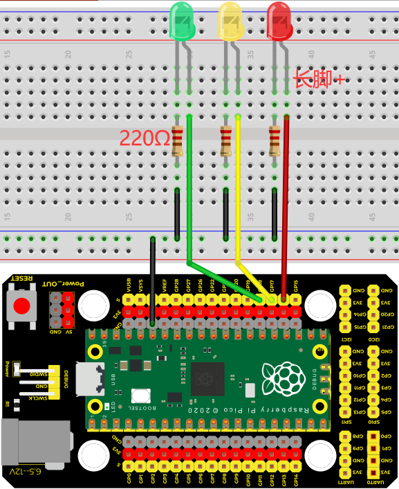

项目代码：

项目现象：

项目代码上传成功后，利用USB线上电，可以看到的现象是：1.首先，绿灯会亮5秒，然后熄灭；2.其次，黄灯会闪烁3次，然后熄灭；3.然后，红灯会亮5秒，然后熄灭；4.继续运行上述1-3个步骤。

### 项目 06：RGB

项目介绍：

RGB led由三种颜色(红、绿、蓝)组成，通过混合这三种基本颜色可以发出不同的颜色。在这个项目中，我们将向你介绍RGB LED，并向你展示如何使用树莓派Pico板控制RGB LED发出不同的颜色光。即使RGB LED是非常基本的，但这也是一个介绍自己或他人电子和编码基础的伟大方式。

项目元件：

|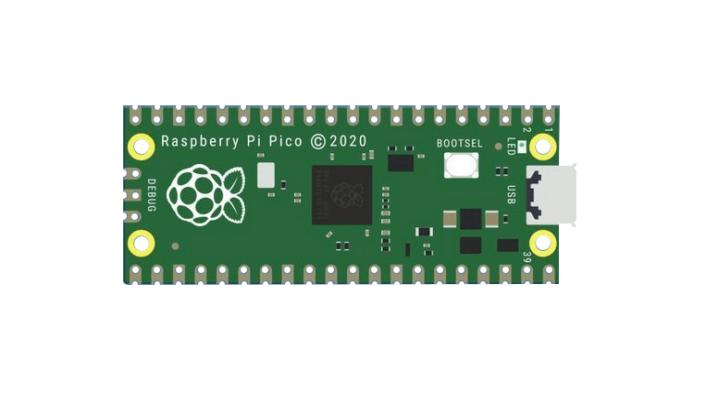||||
|树莓派Pico板*1|树莓派Pico板的扩展板*1|公对母杜邦线若干|RGB LED*1|
|||||
|220Ω电阻*3|面包板*1|USB 线*1||

元件知识：

显示器大多遵循RGB颜色标准，电脑屏幕上的所有颜色都是由红、绿、蓝三种颜色以不同比例混合而成。

这个RGB LED有4个引脚，每个颜色(红，绿，蓝)和一个共同的阴极。为了改变RGB led的亮度，我们可以使用树莓派Pico板的PWM引脚。PWM引脚会给RGB led不同占空比的信号以获得不同的颜色。

如果我们使用3个10位PWM来控制RGBLED，理论上我们可以通过不同的组合创建210\*210\*210=
1,073,741,824(10亿)种颜色。

项目电路图和接线图：

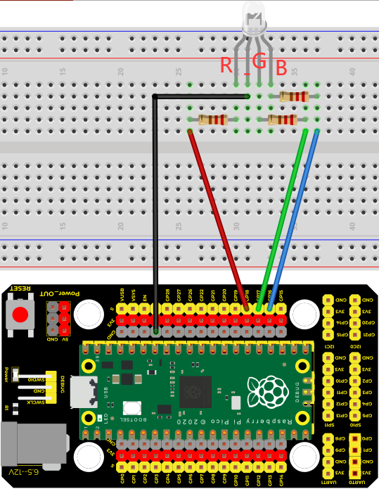

项目代码：

我们需要创建三个PWM通道，并使用随机占空比来使RGB LED亮随机颜色灯。

项目现象：

项目代码上传成功后，利用USB线上电，可以看到的现象是：RGB     LED开始显示随机颜色。

### 项目 07：流水灯

项目介绍：

在日常生活中，我们可以看到许多由不同颜色的led组成的广告牌。他们不断地改变灯光(像流水一样)来吸引顾客的注意。在这个项目中，我们将使用树莓派Pico板控制10个leds实现流水的效果。

项目元件：

|||||
|-|-|-|-|
|树莓派Pico板*1|树莓派Pico板的扩展板*1|公对母杜邦线若干|红色LED*10|
|||||
|220Ω电阻*10|面包板*1|跳线若干|USB 线*1|

项目电路图和接线图:

项目代码：

本项目是设计制作一个流水灯。这是这些行动：首先打开LED
\#1，然后关闭它。然后打开LED
\#2，然后关闭…并对所有10个LED重复同样的操作，直到最后一个LED关闭。这一过程反复进行，以实现流水的“运动”。

项目现象：

项目代码上传成功后，利用USB线上电，可以看到的现象是：10个LED将从左到右点亮，然后从右到左返回。

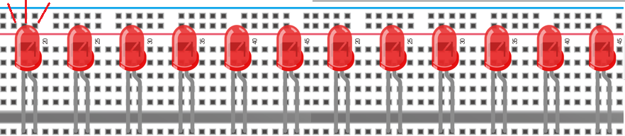

### 项目 08：一位数码管

项目介绍：

七段数码管是一种显示十进制数字的电子显示设备，广泛应用于数字时钟、电子仪表、基本计算器和其他显示数字信息的电子设备。甚至我们在电影中看到的炸弹也有七段数码管。也许七段数码管看起来不够现代，但它们是更复杂的点阵显示器的替代品，在有限的光线条件下和强烈的阳光下都很容易使用。在这个项目中，我们将使用树莓派Pico板控制一位数码管显示数字。

项目元件：

|||||
|-|-|-|-|
|树莓派Pico板*1|树莓派Pico板的扩展板*1|公对母杜邦线若干|一位数码管*1|
|||||
|220Ω电阻*8|面包板*1|USB 线*1||

 元件知识：

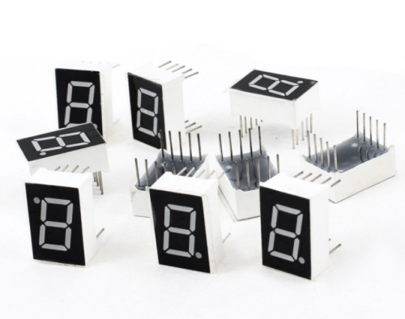

一位数码管显示原理：数码管显示是一种半导体发光器件。它的基本单元是一个发光二极管(LED)。数码管显示根据段数可分为7段数码管和8段数码管。8段数码管比7段多一个LED单元(用于小数点显示)。七段LED显示屏的每段是一个单独的LED。根据LED单元接线方式，数码管可分为共阳极数码管和共阴极书案管。

在共阴极7段数码管中，分段LED的所有阴极(或负极)都连接在一起，你应该把共阴极连接到GND，要点亮一个分段LED，你可以将其关联的引脚设置为HIGH。

在共阳极7段数码管中，所有段的LED阳极(正极)都连接在一起，你应该把共阳极连接到+5V。要点亮一个分段LED，你可以将其关联的引脚设置为LOW。

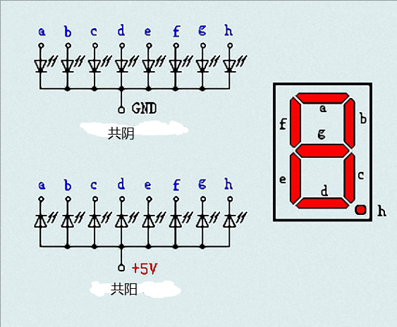

数码管的每个部分由一个LED组成。所以当你使用它的时候，你也需要使用一个限流电阻。否则，LED会被烧坏。在这个实验中，我们使用了一个普通的共阴极一位数码管。正如我们上面提到的，你应该将公共阴极连接到GND。要点亮一个分段LED，你可以将其关联的引脚设置为HIGH。

项目电路图和接线图：

注意：插入面包板的七段数码管方向与接线图一致，右下角多一个点。

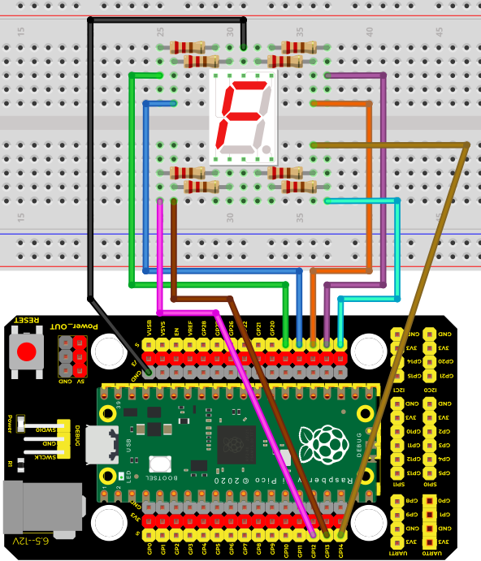

项目代码：

数字显示分7段，小数点显示分1段。当显示某些数字时，相应的段将被点亮。例如，当显示数字1时，b和c段将被打开。

项目现象：

项目代码上传成功后，利用USB线上电，可以看到的现象是：一位数码管将显示从9到0的数字。

### 项目 09：四位数码管

项目介绍：

四位数码管是一种非常实用的显示器件。电子时钟的显示，球场上的记分员，公园里的人数都是需要的。由于价格低廉，使用方便，越来越多的项目将使用4位数码管。在这个项目中，我们使用树莓派Pico板控制四位数码管来显示数字。

项目元件：

|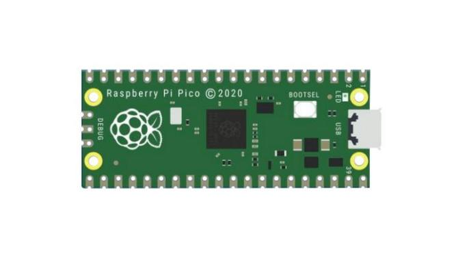||||
|-|-|-|-|
|树莓派Pico板*1|树莓派Pico板的扩展板*1|220Ω 电阻*8|四位数码管*1|
|||||
|面包板*1|公对母杜邦线若干|USB 线*1||

元件知识：

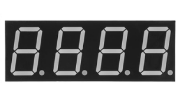

四位数码管：四位数码管有共阳极和共阴极两种四位数码管，显示原理是和一位数码管是类似的，都是8个GPIO口控制数码管的显示段，就是8个led灯，不过，这里是4位的，所以就还需要4个GPIO口来控制位选择端，就是选择哪个单个数码管亮，位的切换很快，肉眼区分不出来，就能看起来是多个数码管同时显示的了。

我们的四位数码管是共阴极的。

下图为4位数码管的引脚图，G1、G2、G3、G4就是控制位的引脚。

下图为4位数码管内部布线原理图

项目电路图和接线图：

项目现象：

项目代码上传成功后，利用USB线上电，你会看到的现象是：四位数码管显示数字，并在一个无限循环中重复这些动作。

### 项目 10：8×8 点阵显示

项目介绍：

点阵屏是一种电子数字显示设备，可以显示机器、钟表、公共交通离场指示器和许多其他设备上的信息。在这个项目中，我们将使用树莓派Pico板控制8x8 LED点阵来显示数字0-9。

项目元件：

|||||
|-|-|-|-|
|树莓派Pico板*1|树莓派Pico板的扩展板*1|8*8点阵屏*1|USB 线*1|
|||||
|公对母杜邦线若干|220Ω 电阻*8|面包板*1||

元件知识：

8\*8LED Matrix：8\*8点阵，就是由64个led灯组成，有行共阳极和行共阴极两种，我们的模块是行共阳极的，也就是每一行有一条线将LED的正极连到一起，列就是将LED灯的负极连接到一起，看下图：

项目电路图和接线图：

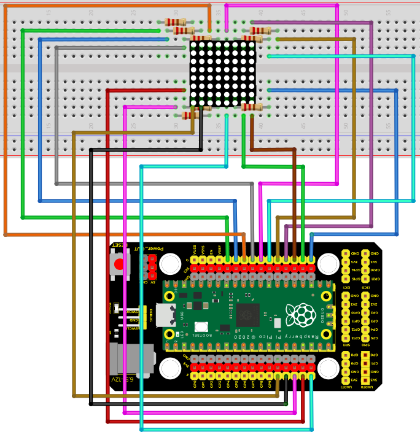

项目代码：

项目现象：

项目代码上传成功后，利用USB线上电，你会看到的现象是：8\*8点阵屏显示数字0-9。

### 项目 11：74HC595N 控制 8 个灯 

项目介绍：

在之前的项目中，我们已经学过了怎样点亮一个LED。

树莓派Pico板上只有26个IO端口，我们如何点亮大量的led呢?
有时可能会耗尽树莓派Pico板上的所有引脚，这时候就需要用移位寄存器扩展它。你可以使用74HC595N芯片一次控制8个输出，而只占用你的微控制器上的几个引脚。你还可以将多个寄存器连接在一起，以进一步扩展输出，在这个项目中，我们将使用树莓派Pico板，74HC595芯片和LED制作一个流水灯来了解74HC595芯片的功能。

项目元件：

||||
|-|-|-|
|树莓派Pico板*1|树莓派Pico板的扩展板*1|74HC595N芯片*1|
||||
|220Ω电阻*8|面包板*1|跳线若干|
||||
|红色LED*8|USB 线*1|公对母杜邦线若干|

元件知识：

74HC595N芯片：简单来说就是具有8
位移位寄存器和一个存储器，以及三态输出功能。移位寄存器和存储器同步于不同的时钟，数据在移位寄存器时钟SCK的上升沿输入，在存储寄存器时钟RCK的上升沿进入的存储寄存器中去。如果两个时钟连在一起，则移位寄存器总是比存储寄存器早一个脉冲。移位寄存器有一个串行移位输入端（SI）和一个用于级联的串行输出端（SQH）,8位移位寄存器可以异步复位（低电平复位），存储寄存器有一个8位三态并行的总线输出，当输出使能（OE）被使能（低电平有效）将存储寄存器中输出至74HC595N的引脚（总线）。

引脚说明：

|13引脚OE|是一个输出使能引脚，用于确保锁存器的数据是否输入到Q0-Q7引脚。在低电平时，不输出高电平。在本实验中，我们直接连接GND，保持低电平输出数据。|
|-|-|
|14引脚SI|这是74HC595接收数据的引脚，即串行数据输入端，一次只能输入一位，那么连续输入8次，就可以组成一个字节了。|
|10引脚SCLR|一个初始化存储寄存器管脚的管脚。在低电平时初始化内部存储寄存器。在这个实验中，我们连接VCC以保持高水平。|
|11引脚SCK|移位寄存器的时钟引脚，上升沿时，移位寄存器中的数据整体后移，并接收新的数据输入|
|12引脚RCK|存储寄存器的时钟输入引脚。上升沿时，数据从移位寄存器转存到存储寄存器中。这时数据就从Q0~Q7端口并行输出。|
|9引脚SQH|引脚是一个串行输出引脚，专门用于芯片级联，接下一个74HC595的SI端|
|Q0--Q7(15引脚，1-7引脚)|八位并行输出端，可以直接控制数码管的8个段|

项目电路图和接线图：

注意：需要注意74HC595N芯片插入的方向

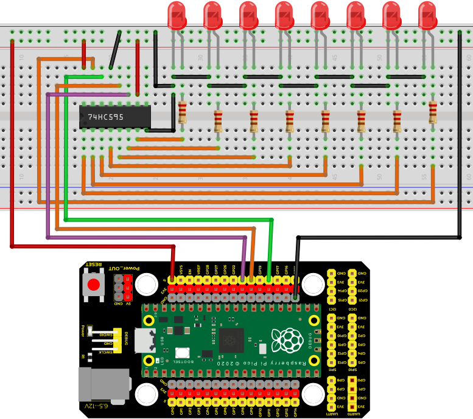

项目现象：

项目代码上传成功后，利用USB线上电，可以看到的现象是：8个LED开始以流水模式闪烁。

### 项目 12：有源蜂鸣器

项目介绍：

有源蜂鸣器是一个发声组件。它被广泛用作电脑、打印机、报警器、电子玩具、电话、计时器等的发声元件。它有一个内在的振动源，只需连接5V电源，即可持续发出嗡嗡声。在这个项目中，我们将使用树莓派Pico板控制有源蜂鸣器发出“滴滴”声。

项目元件：

|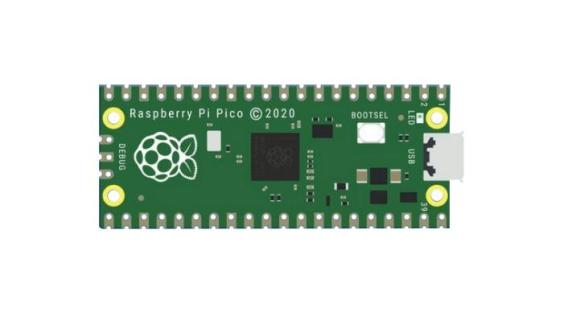|||
|-|-|-|
|树莓派Pico板*1|树莓派Pico板的扩展板*1|面包板*1|
||||
|NPN型晶体管(S8050)*1|1kΩ电阻*1|跳线若干|
||||
|有源蜂鸣器*1|USB 线*1|公对母杜邦线若干|

 元件知识：

有源蜂鸣器内部有一个简单的振荡器电路，可以将恒定的直流电转换成特定频率的脉冲信号。一旦有源蜂鸣器收到一个高电平，它将产生声音。而无源蜂鸣器是一种内部没有振动源的集成电子蜂鸣器，它必须由2K-5K方波驱动，而不是直流信号。这两个蜂鸣器的外观非常相似，但是一个带有绿色电路板的蜂鸣器是无源蜂鸣器，而另一个带有黑色胶带的是有源蜂鸣器。无源蜂鸣器不能区分正极性而有源极性蜂鸣器是可以。如下所示：

晶体管:
由于蜂鸣器需要很大的电流，ESP32输出能力的GPIO不能满足要求，这里需要一个NPN型晶体管来放大电流。晶体管，全称:半导体晶体管，是一种控制电流的半导体器件。晶体管可以用来放大微弱信号，也可以用作开关。它有三个电极(pin)：基极(b)，集电极(c)和发射极(e)。当电流通过“be”之间时，“ce”将允许几倍的电流通过(晶体管放大)，此时，晶体管在放大区工作。当“be”之间的电流超过某个值时，“ce”将不再允许电流增加，此时晶体管工作在饱和区。晶体管有两种类型如下所示：PNP和NPN

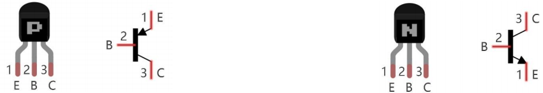

PNP晶体管 NPN晶体管

在我们的套件中，PNP晶体管标记为8550,NPN晶体管标记为8050。

基于晶体管的特性，它常被用作数字电路中的开关。由于单片机输出电流的能力很弱，我们将使用晶体管来放大电流和驱动大电流的元件。在使用NPN晶体管驱动蜂鸣器时，通常采用以下方法：如果GPIO输出高电平，电流将流过R1，晶体管将传导，蜂鸣器将发出声音。如果GPIO输出低电平，没有电流流过R1，晶体管就不会传导，蜂鸣器也不会响。在使用PNP晶体管驱动蜂鸣器时，通常采用以下方法：如果GPIO输出低电平，电流将流过R1，晶体管将传导，蜂鸣器将发出声音。如果GPIO输出高电平，没有电流流过R1，晶体管就不会传导，蜂鸣器也不会响。

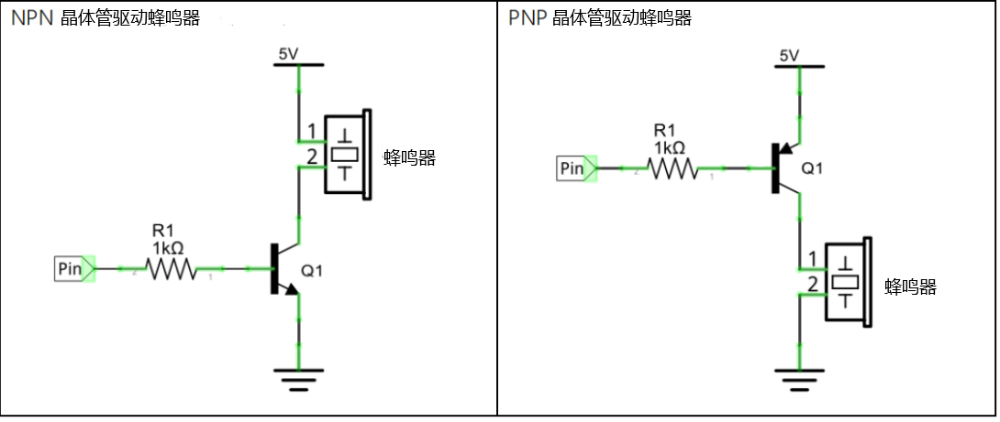

项目电路图和接线图：

注意：1.该电路中蜂鸣器的电源为5V。在3.3V的电源下，蜂鸣器可以工作，但会降低响度。

VUSB应连接到USB线的正极，如果它连接到GND，它可能烧坏电脑或树莓派Pico板。同样，树莓派Pico板的36-40引脚接线时也要小心，避免短路。

有源蜂鸣器正极(“+”/长引脚)接引脚16，负极（短引脚）接GND。

项目现象：

项目代码上传成功后，利用USB线上电，可以看到的现象是：有源蜂鸣器发出“滴滴”声。

### 项目 13：无源蜂鸣器

项目介绍

在之前的项目中，我们研究了有源蜂鸣器，它只能发出一种声音，可能会让你觉得很单调。这个项目将学习另一种蜂鸣器，无源蜂鸣器。与有源蜂鸣器不同，无源蜂鸣器可以发出不同频率的声音。在这个项目中，你将使用树莓派Pico板控制无源蜂鸣器发出警报声。

项目元件：

||||
|-|-|-|
|树莓派Pico板*1|树莓派Pico板的扩展板*1|面包板*1|
||||
|NPN型晶体管(S8050)*1|1kΩ电阻*1|跳线若干|
||||
|无源蜂鸣器*1|USB 线*1|公对母杜邦线若干|

元件知识：

无源蜂鸣器是一种内部没有振动源的集成电子蜂鸣器。它必须由2K-5K方波驱动，而不是直流信号。这两个蜂鸣器的外观非常相似，但是一个带有绿色电路板的蜂鸣器是无源蜂鸣器，而另一个带有黑色胶带的是有源蜂鸣器。无源蜂鸣器不能区分正极性而有源极性蜂鸣器是可以。

晶体管: 请参考项目12.

项目电路图和接线图:

项目现象：

项目代码上传成功后，利用USB线上电，可以看到的现象是：无源蜂鸣器发出警报声。

### 项目 14：小台灯

项目介绍：

你知道树莓派Pico板可以在你按下按键的时候点亮LED吗?
在这个项目中，我们将使用树莓派Pico板，一个按键开关和一个LED来制作一个迷你台灯。

项目代码：

|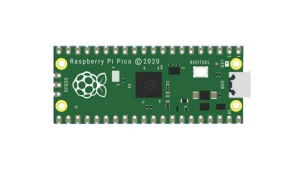|||||
|-|-|-|-|-|
|树莓派Pico板*1|树莓派Pico板的扩展板*1|按键*1|红色 LED*1|10KΩ电阻*1|
||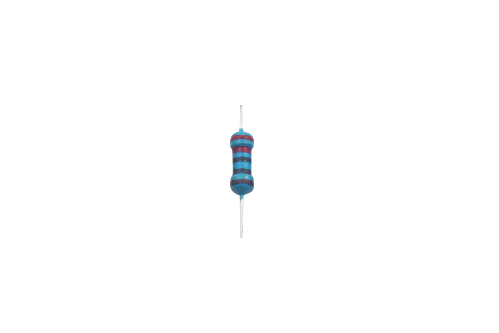||||
|面包板*1|220Ω电阻*1|USB 线*1|公对母杜邦线若干|按键帽*1|

元件知识：

按键：按键可以控制电路的通断，把按键接入电路中，不按下按键的时候电路是断开的，

一按下按键电路就通啦，但是松开之后就又断了。可是为什么按下才通电呢？这得从按键的内部构造说起。没按下之前，电流从按键的一端过不去另一端；按下的时候，按键内部的金属片把两边连接起来让电流通过。

按键内部结构如图：，未按下按键之前，1、2就是导通的，3、4也是导通的，但是1、3或1、4或2、3或2、4是断开（不通）的；只有按下按键时，1、3或1、4或2、3或2、4才是导通的。

在设计电路时，按键开关是最常用的一种元件。

按键的原理图:     
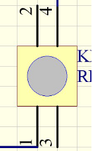
  
什么是按键抖动？

我们想象的开关电路是“按下按键-立刻导通”“再次按下-立刻断开”，而实际上并非如此。

按键通常采用机械弹性开关，而机械弹性开关在机械触点断开闭合的瞬间（通常
10ms左右），会由于弹性作用产生一系列的抖动，造成按键开关在闭合时不会立刻稳定的接通电路，在断开时也不会瞬时彻底断开。

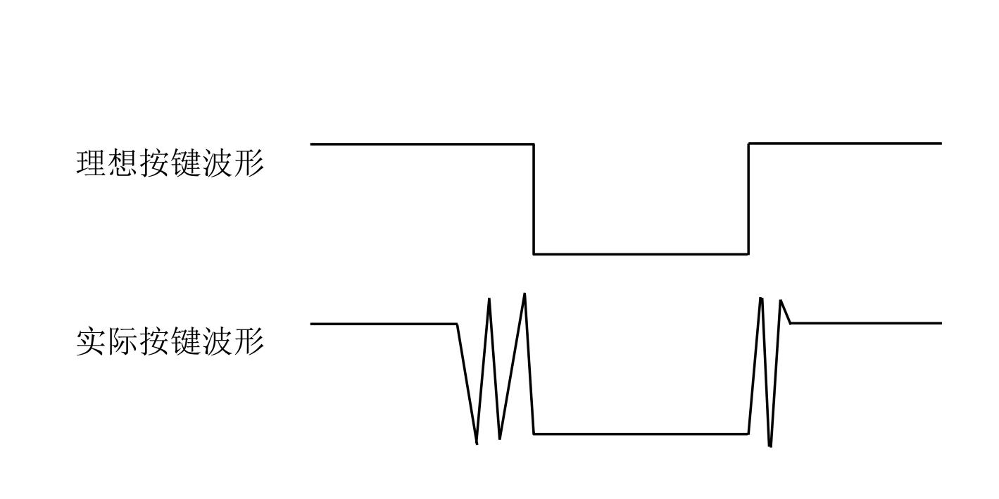

那又如何消除按键抖动呢？

常用除抖动方法有两种：软件方法和硬件方法。这里重点讲讲方便简单的软件方法。

我们已经知道弹性惯性产生的抖动时间为10ms
左右，用延时命令推迟命令执行的时间就可以达到除抖动的效果。

所以我们在代码中加入了0.02秒的延时以实现按键防抖的功能。

 项目电路图和接线图：

注意:

怎样连接LED

怎样识别五色环220Ω电阻和五色环10KΩ电阻

项目现象：

项目代码上传成功后，利用USB线上电，可以看到的现象是：按下按钮，LED亮起；当按钮松开时，LED仍亮着。再次按下按钮，LED熄灭；当按钮释放时，LED保持关闭。是不是很像个小台灯？

### 项目 15：模拟沙漏

项目介绍：

古代人没有电子时钟，就发明了沙漏来测时间，沙漏两边的容量比较大，在一边装了细沙，中间有个很小的通道，将沙漏直立，有细沙的一边在上方，由于重力的作用，细沙就会往下流通过通道到沙漏的另一边，当细沙都流到下边了，就倒过来，把一天反复的次数记录下来，第二天就可以通过沙漏反复流动的次数而知道这一天大概的时间了。这一课我们将利用树莓派Pico板控制倾斜开关和LED灯来模拟沙漏，制作一个电子沙漏。

项目元件：

||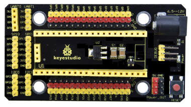|||
|-|-|-|-|
|树莓派Pico板*1|树莓派Pico板的扩展板*1|倾斜开关*1|红色 LED*4|
|||||
|面包板*1|220Ω电阻*4|USB 线*1||
|||||
|10KΩ电阻*1|跳线若干|公对母杜邦线若干||

元件知识：

倾斜开关也叫数字开关。里面有一个可以滚动的金属球。采用金属球滚动与底部导电板接触的原理来控制电路的通断。当倾斜开关是滚珠型倾斜感应单方向性触发开关，当倾斜传感器向触发端（两根金属脚端）倾斜时，倾斜开关处于闭路状态，模拟端口的电压约为5V(二进制数为1023)。这样，LED会亮起。当倾斜开关在水平位置或向另一端倾斜时，倾斜开关处于开路状态，模拟端口的电压约为0V(0二进制)。LED将会关闭。在程序中，我们根据模拟端口的电压值，是否大于2.5V(512二进制)来判断开关是开还是关。

这里用倾斜开关的内部结构来说明它是如何工作的，显示如下图：

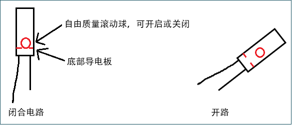

项目电路图和接线图：

注意:

怎样连接LED

怎样识别五色环220Ω电阻和五色环10KΩ电阻

项目结果：

项目代码上传成功后，利用USB线上电，可以看到的现象是：将面包板倾斜到一定角度，led就会一个一个地亮起来。当回到上一个角度时，led会一个一个关闭。就像沙漏一样，随着时间的推移，沙子漏了出来。

### 项目 16：防窃警报器

项目介绍：

人体红外传感器测量运动物体发出的热的红外(IR)线。该传感器可以检测人、动物和汽车的运动，从而触发安全警报和照明。它们被用来检测移动，是安全的理想选择，如防盗警报和安全照明系统。在这个项目中，我们将使用树莓派Pico板控制人体红外传感器、蜂鸣器和LED来模拟防盗报警器。

项目元件：

|||||
|-|-|-|-|
|树莓派Pico板*1|树莓派Pico板的扩展板*1|人体红外传感器*1|有源蜂鸣器*1|
|||||
|面包板*1|公对母杜邦线若干|220Ω电阻*1|USB 线*1|
|||||
|红色 LED*1|跳线若干|NPN型晶体管(S8050)*1|1kΩ电阻*1|
|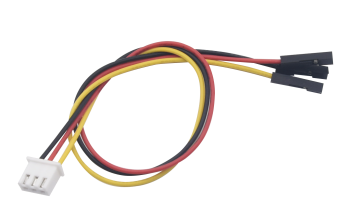||||
|3Pin 杜邦母单*1||||

元件知识：

人体红外传感器：其原理是某些晶体，例如钽酸锂、硫酸三甘肽等受热时，晶体两端会产生数量相等、符号相反的电荷，将这些电荷经放大器可转换为电压输出。而人体是会释放红外线的，虽然比较微弱，但是还是可以检测得到的。人体红外传感器检测附近有人运动时，传感器信号端输出高电平1，否则输出低电平0。特别注意，这个传感器可以检测在运动中的人、动物和汽车，静止中的人、动物和汽车是检测不到的，检测最远距离大约为7米左右。

注意：人体红外传感器应避开日光、汽车头灯、白炽灯直接照射，也不能对着热源(如暖气片、加热器)或空调，以避免环境温度较大的变化而造成误报。同时还易受射频辐射的干扰。

传感器技术参数：

最大输入电压：DC 3.3 ~ 5 v

最大工作电流：50MA

最大功率：0.3W

工作温度：-20 ~ 85℃

输出高电平3V，低电平0 V

延迟时间：大约2.3到3秒钟

检测角度：大约100度

检测最远距离：大约 7米左右

指示灯输出(当输出高电平时，它将点亮)

引脚限制电流：50MA

传感器原理图：

项目电路图和接线图：

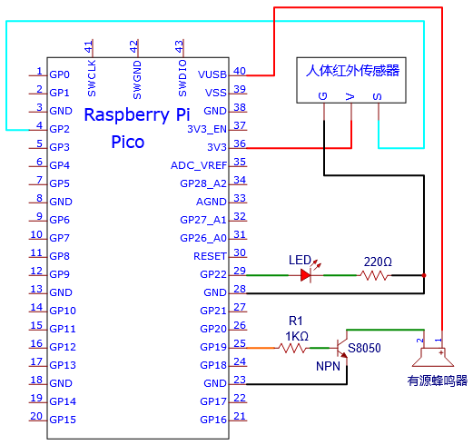

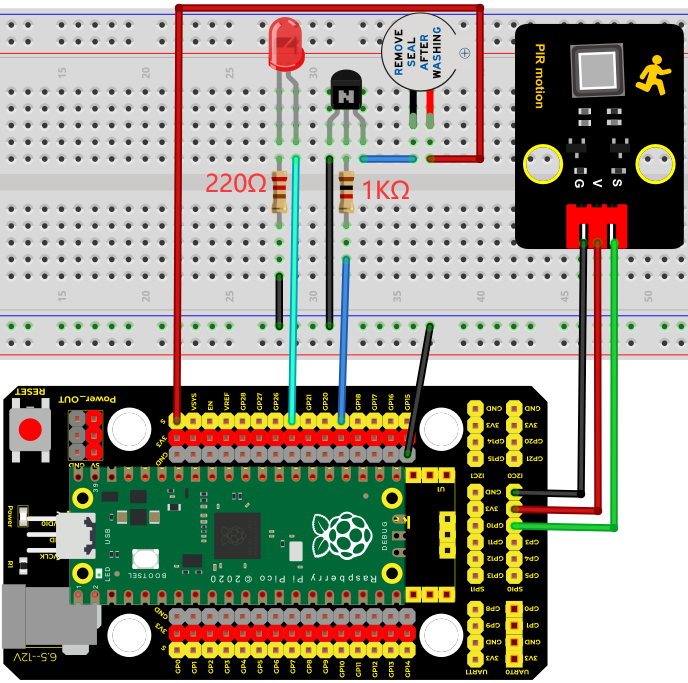

项目现象：

项目代码上传成功后，利用USB线上电，可以看到的现象是：如果人体红外传感器检测到附近有人移动时，蜂鸣器就会不断地发出警报，且LED不断地闪烁。

### 项目 17： I2C 128×32 LCD

项目介绍：

在生活中，我们可以利用显示器等模块来做各种实验。你也可以DIY各种各样的小物件。例如，用一个温度传感器和显示器做一个温度测试仪，或者用一个超声波模块和显示器做一个距离测试仪。下面，我们将使用LCD_128X32_DOT模块作为显示器，将其连接到树莓派Pico控制板上。将使用树莓派Pico主板控制LCD_128X32_DOT显示屏显示各种英文文字、常用符号和数字。

项目元件： 

||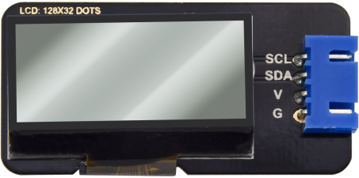||
|-|-|-|
|树莓派Pico板*1|LCD_128X32_DOT*1|树莓派Pico板的扩展板*1|
|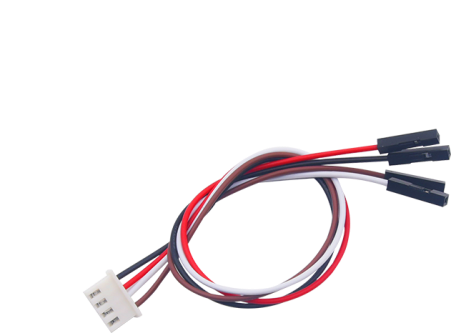|||
|4P 转杜邦线母单10厘米*1|USB 线*1||

元件知识：

LCD_128X32_DOT：一个像素为128\*32的液晶屏模块，它的驱动芯片为ST7567A。模块使用IIC通信方式，同时，代码中包含所有英文字母和常用符号的库，可以直接调用。使用时，我们还可以在代码中设置，让英文字母和符号显示不同文字大小。为了方便设置图案显示，我们还提供一个取模软件，可将特定的图案转化成控制代码，然后直接复制到测试代码中使用的。

LCD_128X32_DOT原理图：

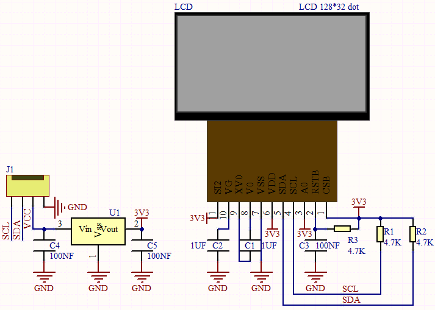

LCD_128X32_DOT技术参数：

显示像素：128\*32 字符

芯片工作电压：4.5 ~ 5.5V

工作电流：100mA (5.0V)

模块最佳工作电压：5.0V

项目接线图：

特别注意：这里必须使用4P     转杜邦线母单10厘米连接LCD_128X32_DOT，LCD_128X32_DOT才会显示正常；否则，使用4P     转杜邦线母单20厘米，LCD_128X32_DOT可能会显示不正常。

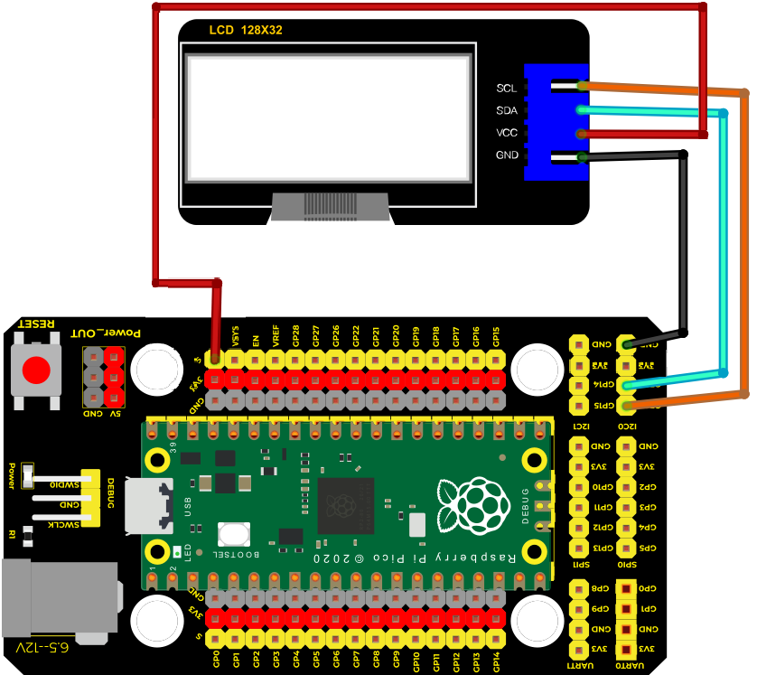

添加lcd128_32_io库：

本项目代码使用了一个名为“lcd128_32_io”库。如果你还没有添加，请在学习之前添加它。添加第三方库的步骤如下:

打开Arduino IDE，单击“项目”→“加载库”→“添加 .ZIP
库...”。在弹出窗口中找到该目录下名为：4. Arduino 教程\1. Windows 系统\3.
库文件\LCD_128X32.ZIP的文件，先选中LCD_128X32.ZIP文件，再单击“打开”。

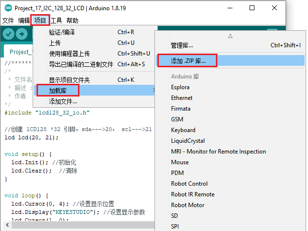

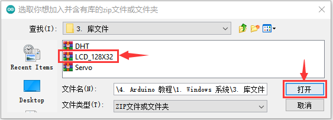

项目代码：

lcd128_32_io库添加完成后，你可以打开我们提供的代码：

项目现象：

项目代码上传成功后，利用USB线上电，你会看到的现象是：128X32LCD模块显示屏第一行显示“keyes”、第二行显示“ABCDEFGHIJKLMNOPQR”、第三行显示“123456789+-\*/\<\>=$@”、第四行显示“%^&(){}:;'|?,.~\\\[\]”。

### 项目 18：小风扇

项目介绍：

在炎热的夏季，需要电扇来给我们降温，那么在这个项目中，我们将使用树莓派Pico板控制直流电机模块和小扇叶来制作一个小电扇。

项目元件：

||||
|-|-|-|
|树莓派Pico板*1|树莓派Pico板的扩展板*1|跳线若干|
||||
|L293D芯片*1|面包板*1|USB 线*1|
||||
|直流电机*1|风扇片*1|公对母杜邦线若干|

元件知识:

L293D芯片：L293D是一种直流电动驱动IC，在一些机器人项目中可用来驱动直流电机或步进电机。它共有16个引脚，可以同时驱动两路直流电机。输入电压范围：4.5 V ~ 36 V，每通道输出电流：MAX 600mA，可以驱动感性负载，特别是其输入端可以与单片机直接相连，从而很方便地受单片机控制。当驱动小型直流电机时，可以直接控制两路电机，并且可以实现电机正转与反转，实现此功能只需改变输入端的高低电平。市面上有许多采用L293D芯片的电机驱动板，当然我们也可以自己通过简单连接来使用它。

L293D引脚图：

|引脚号|引脚名称|描述|
|-|-|-|
|1|Enable1|该引脚使能输入引脚Input 1(2)和Input 2(7)|
|2|In1|直接控制输出1引脚，由数字电路控制。|
|3|Out1|连接到电机1的一端|
|4|0V|接地引脚连接到电路的接地(0V)|
|5|0V|接地引脚连接到电路的接地(0V)|
|6|Out2|连接到电机1的另一端|
|7|In2|直接控制输出2引脚。由数字电路控制|
|8|+V motor|连接到运行电机的电压引脚(4.5V至36V)|
|9|Enable2|该引脚使能输入引脚输入3(10)和输入4(15)|
|10|In3|直接控制输出3引脚。由数字电路控制|
|11|Out3|连接到电机2的一端|
|12|0V|接地引脚连接到电路的接地(0V)|
|13|0V|接地引脚连接到电路的接地(0V)|
|14|Out4|连接到电机2的另一端|
|15|In4|直接控制输出4引脚，由数字电路控制|
|16|+V|连接到+ 5V以启用IC功能|

项目电路图和接线图：

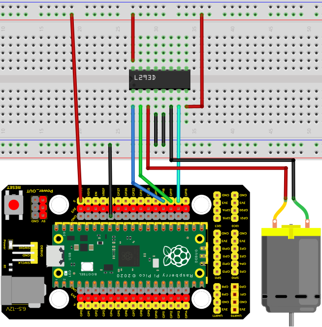

项目现象：

项目代码上传成功后，利用USB线上电，可以看到的现象是：小风扇先逆时针转5秒，停止2秒，再顺时针转5秒，停止2秒，以此规律重复执行。

### 项目 19：舵机

项目介绍：

舵机是一种可以非常精确地旋转的电机。目前已广泛应用于玩具车、遥控直升机、飞机、机器人等领域。在这个项目中，我们将使用树莓派Pico板控制舵机转动。

项目元件：

|||
|-|-|
|树莓派Pico板*1|树莓派Pico板的扩展板*1|
|||
|舵机*1|USB 线*1|

元件知识：

舵机：

舵机是一种位置伺服的驱动器，主要是由外壳、电路板、无核心马达、齿轮与位置检测器所构成。其工作原理是由接收机或者单片机发出信号给舵机，其内部有一个基准电路，产生周期为20ms，宽度为1.5ms
的基准信号，将获得的直流偏置电压与电位器的电压比较，获得电压差输出。经由电路板上的IC
判断转动方向，再驱动无核心马达开始转动，透过减速齿轮将动力传至摆臂，同时由位置检测器送回信号，判断是否已经到达定位。适用于那些需要角度不断变化并可以保持的控制系统。当电机转速一定时，通过级联减速齿轮带动电位器旋转，使得电压差为0，电机停止转动。一般舵机旋转的角度范围是0度到180
度。

控制舵机的脉冲周期为20ms，脉冲宽度为0.5ms ~ 2.5ms，对应位置为-90°~
+90°。下面是以一个180°角的舵机为例：

伺服电机有多种规格，但它们都有三根连接线，分别是棕色、红色、橙色(不同品牌可能有不同的颜色)。棕色为GND，红色为电源正极，橙色为信号线。

项目接线图：

舵机供电时请注意，电源电压应为3.3V-5V。请确保在将舵机连接到电源时不会出现任何错误。

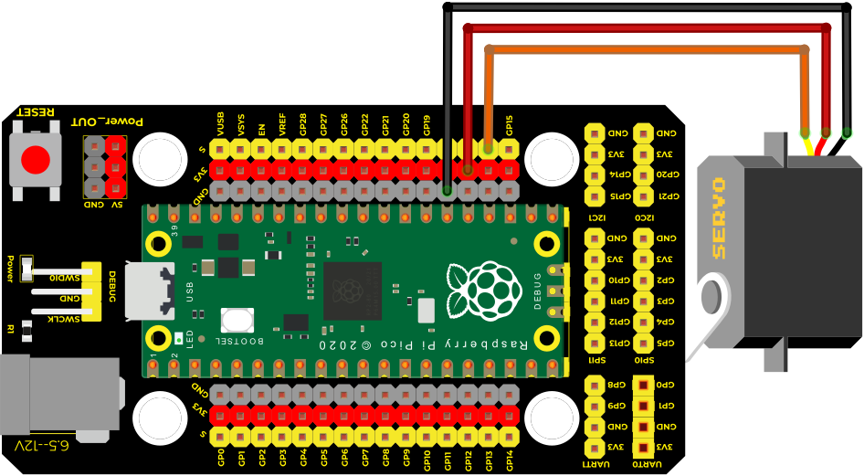

添加Servo库：

本项目代码使用了一个名为“Servo”库，如果你还没有添加它，请在学习之前添加。添加第三方库的步骤如下:

方法一：

打开arduino     IDE，点击“项目”→“加载库”→“管理库...”。在搜索栏输入“Servo”，选择“Servo”并点击“安装”进行添加。请参考以下操作：

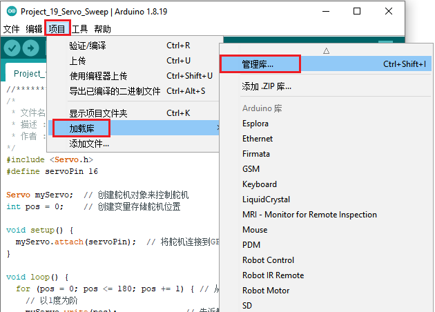

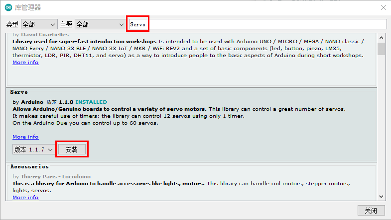

方法二：

打开Arduino IDE，单击“项目”→“加载库”→“添加 .ZIP
库...”。在弹出窗口中找到该目录下名为：4. Arduino 教程\1. Windows 系统\3.
库文件\Servo.ZIP的文件。先单击“Servo.ZIP”文件，再单击“打开”。

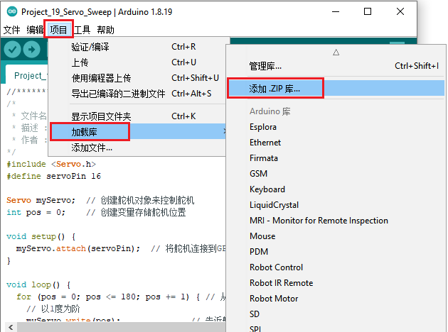

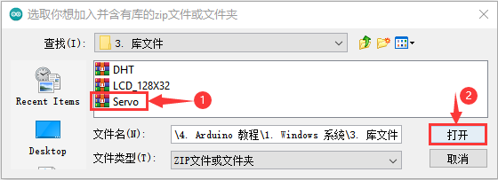

项目代码：

Servo库添加完成后，你可以打开我们提供的代码：

 项目现象：

项目代码上传成功后，利用USB线上电，你会看到的现象是：舵机将从0°旋转到180°，然后反转方向使其从180°旋转到0°，并在一个无限循环中重复这些动作。

### 项目 20：步进电机 

项目介绍：

步进电机定位准确，是工业机器人、3D打印机、大型车床等机械设备中最重要的部件。在这个项目中，我们将使用树莓派Pico板控制ULN2003步进电机驱动板来驱动步进电机转动。

项目元件：

||||
|-|-|-|
|树莓派Pico板*1|树莓派Pico板的扩展板*1|ULN2003步进电机驱动板*1|
||||
|步进电机*1|母对母杜邦线若干|USB 线*1|

 项目知识：

步进电机：是由一系列电磁线圈控制的电机。它可以根据需要旋转精确的度数(或步数)，允许你将它移动到一个精确的位置并保持该位置。它是通过在很短的时间内为电机内部的线圈供电来做到这一点的，但你必须一直为电机供电，以保持它在你想要的位置。有两种基本类型的步进电机，单极步进和双极步进。在本项目中，我们使用的是单极步进电机28-BYJ48。

28BYJ-48步进电机工作原理：

步进电机主要由定子和转子组成，定子是固定不动的，如下图绕着A、B、C、D线圈组的部分，线圈组导通电就会产生磁场；转子就是转动的部分，如下图定子中间的部分，两极是永磁铁。

单步4节拍的转动原理：开始A组线圈导通，转子两极正对着A组线圈；接着A组线圈断开，B组线圈导通，转子就会顺时针转到B组线圈，转子转了一步；B断开，C导通，转子转到C组；C断开，D导通，转子转到D组；D组断开，A组导通，转子转到A组线圈。这样转子就转了半圈180度，接着再重复一次，B-C-D-A，转子转回到A组线圈，这样转子就转了一圈，总共转动了8步。如下图所示，这就是步进电机单节拍转动的原理A -
B - C - D - A ....。

如果想让步进电机逆时针转动，那只要把节拍顺序反过来就行，D - C - B - A -
D .....。

半步8节拍转动原理：8节拍，采用的是单双拍的形式，A - AB - B - BC - C -
CD - D - DA - A ......
，这样运转一拍，转子只会转动半步，例如，A组线圈导通，转子转到正对着A组线圈；接着A和B组一起导通，这样产生的磁场最强的地方在AB组线圈中间，转子两极就会转到AB组线圈中间，也就是顺时针转了半步。

步进电机参数：

我们所提供的步进电机需要转动32步，转子才能转一圈，还经过了1:64的减速齿轮组带动输出轴，这样输出轴转动一圈需要：
32 \* 64 = 2048 步。

电压5V，4相步进电机 ，4节拍模式的步进角为11.25，
8节拍模式步进角为5.625， 减速比为1:64

ULN2003步进电机驱动板：ULN2003型步进电机驱动器，将微弱信号转换为更强的控制信号，从而驱动步进电机。

下面的原理图显示了如何使用ULN2003步进电机驱动板接口将一个单极步进电机接到Raspberry Pi Pico的引脚上，并显示了如何使用四个TIP120的接口。

 项目原理图和接线图：

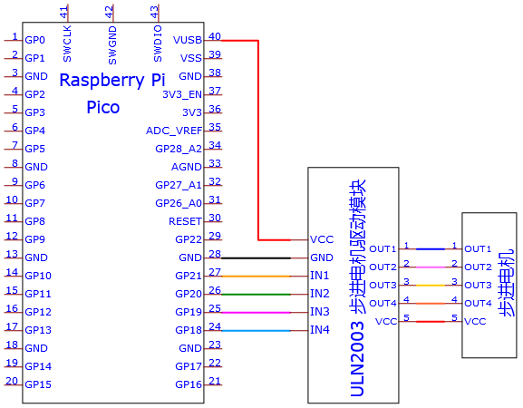

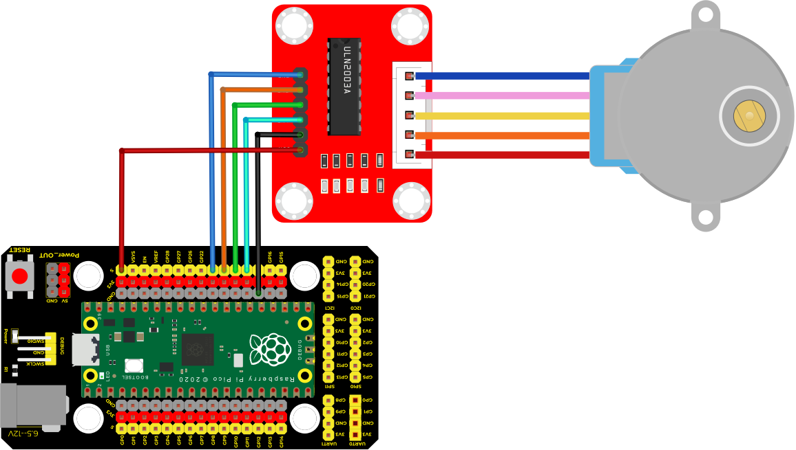

项目结果：

项目代码上传成功后，利用USB线上电，可以看到的现象是：ULN2003驱动模块上D1D2D3D4四个LED点亮，步进电机先顺时针旋转，再逆时针旋转，并保持此状态循环。

### 项目 21：继电器

项目介绍：

在日常生活中，我们一般使用交流来驱动电气设备，有时我们会用开关来控制电器。如果将开关直接连接到交流电路上，一旦发生漏电，人就有危险。从安全的角度考虑，我们特别设计了这款具有NO(常开)端和NC(常闭)端的继电器模块。在这节课我们将学习一个比较特殊，好用的开关，就是继电器模块。

项目元件：

||||||
|-|-|-|-|-|
|树莓派Pico板*1|树莓派Pico板的扩展板*1|继电器模块*1|3Pin 杜邦母单*1|USB 线*1|

元件知识：

继电器：是用小电流去控制大电流运作的一种“自动开关”。

输入电压：3.3V-5V

额定负载：5A 250VAC (NO/NC) 5A 24VDC (NO/NC)

额定负载的意思是，可以使用微型控制器的3.3V-5V控制直流电压24V或者交流电压250V的设备。

继电器原理图：

项目接线图：

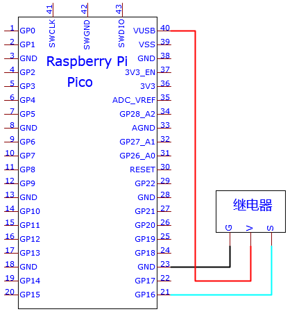

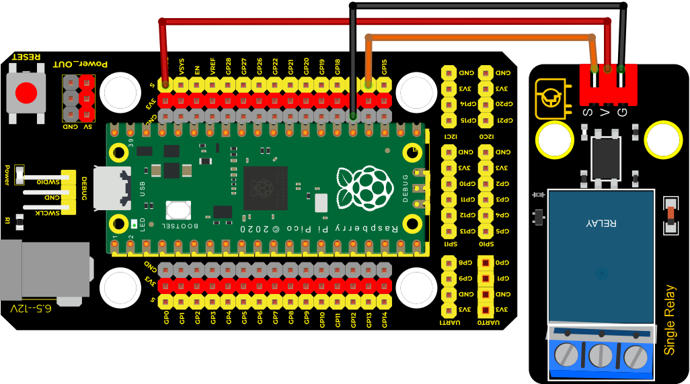

项目结果：

项目代码上传成功后，利用USB线上电，可以看到的现象是：继电器将循环开与关，开启1秒，关闭1秒。同时可以听到继电器开与关的声音，还可以看到继电器上的指示灯指示状态的变化。

### 项目21：调光灯

项目介绍：

电位器是一个带有滑动或旋转触点的三端电阻器，它形成一个可调的分压器。它的工作原理是在均匀电阻上改变滑动触点的位置。在电位器中，整个输入电压被施加到电阻的整个长度上，输出电压是固定触点和滑动触点之间的电压值。在这个项目中，我们将学习使用树莓派Pico板读取电位器的值，并结合LED制作一个调光灯。

项目元件：

|||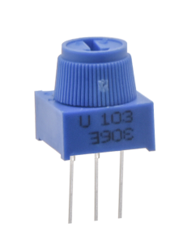||
|-|-|-|-|
|树莓派Pico板*1|树莓派Pico板的扩展板*1|可调电位器*1|红色 LED*1|
|||||
|面包板*1|220Ω电阻*1|公对母杜邦线若干|USB 线*1|

元件知识：

可调电位器：可调电位器是电阻和模拟电子元件的一种，具有0和1两种状态(高电平和低电平)。模拟值不同，其数据状态呈现为1
~ 1024等线性状态。

读取电位器的ADC值和电压值：

我们将电位器连接到树莓派Pico板的模拟IO口上来读取电位器的ADC值和电压值。接线请参照以下接线图：

上传代码成功之后，利用USB线上电，打开串口监视器，设置波特率为115200。可以看到的现象是：串口监视器窗口将打印出电位器的ADC值和电压值，转动电位器手柄时，ADC值和电压值发生变化。如下图所示：

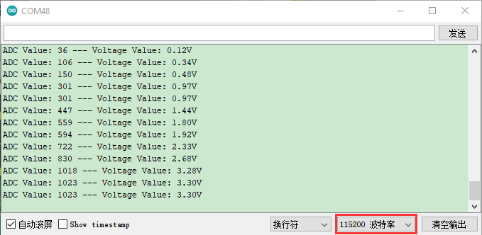

调光灯的电路图和接线图：

在前面一步，我们读取了电位器的ADC值和电压值，现在我们需要将电位器的ADC值转换成LED的亮度，来做成一个亮度可调的灯。见如下所示接线图：

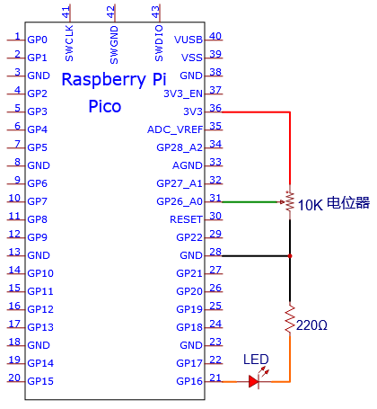

项目现象：

下载项目代码到树莓派Pico板，通过转动电位器手柄改变GP26的输入电压，树莓派Pico板根据这个电压值改变GP16的输出电压，从而改变LED的亮度。

### 项目 23：火焰警报器

项目介绍：

火灾是一种可怕的灾害，火灾报警系统在房屋，商业建筑和工厂中是非常有用的。在本项目中，我们将使用树莓派Pico板控制火焰传感器，蜂鸣器和LED来模拟火灾报警装置。这是一个有意义的创客活动。

项目元件：

|||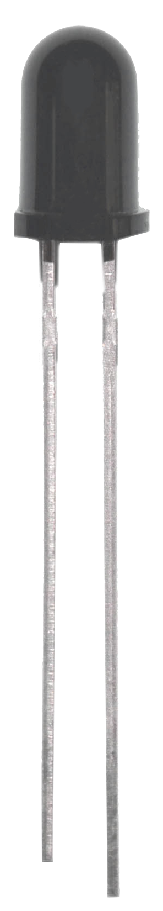|||
|-|-|-|-|-|
|树莓派Pico板*1|树莓派Pico板的扩展板*1|火焰传感器*1|红色 LED*1|有源蜂鸣器*1|
||||||
|面包板*1|220Ω电阻*1|10KΩ电阻*1|跳线若干|USB 线*1|
||||||
|NPN型晶体管(S8050)*1|1kΩ电阻*1|公对母杜邦线若干|||

元件知识：

火焰会发出一定程度的IR光，这种光人眼是看不到的，但我们的火焰传感器可以检测到它，并提醒微控制器（如树莓派Pico板）已经检测到火灾。它有一个专门设计的红外接收管来探测火焰，然后将火焰亮度转换为波动水平信号。接收三极管的短引脚是负极，另一个长引脚是正极。我们应该连接短引脚（负极)到5V，连接长
引脚(正极)到模拟引脚，一个电阻和GND。如下图所示：

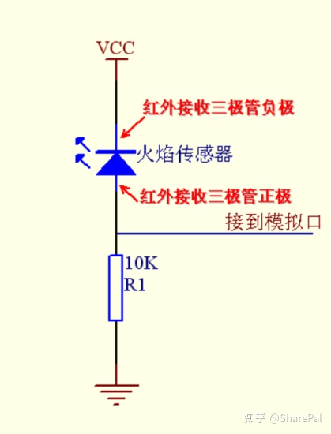

注意：火焰传感器应避开日光、汽车头灯、白炽灯直接照射，也不能对着热源(如暖气片、加热器)或空调，以避免环境温度较大的变化而造成误报。同时还易受射频辐射的干扰。

读取火焰传感器的ADC值和电压值：

我们首先用一个简单的代码来读取火焰传感器的模拟值，并将其打印出来。接线请参照以下接线图：

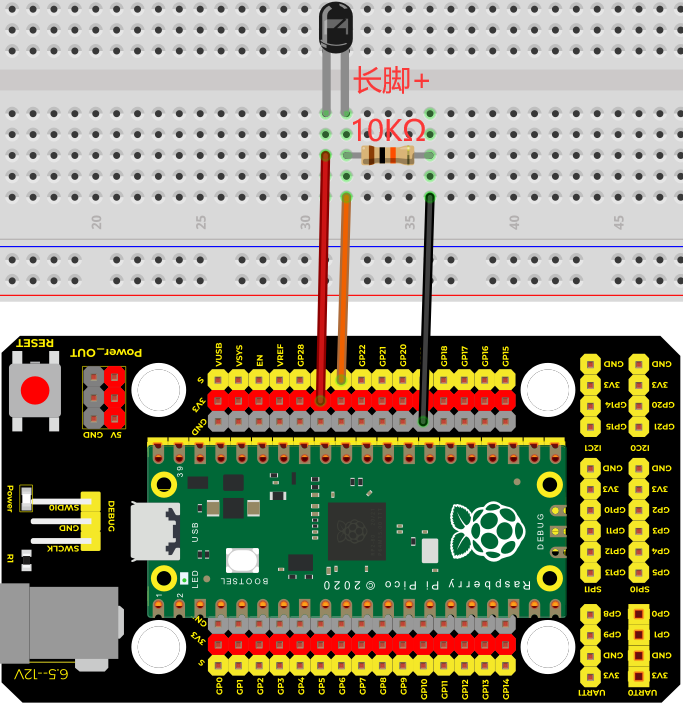

上传代码成功之后，利用USB线上电，打开串口监视器，设置波特率为115200。可以看到的现象是：串口监视器窗口将打印出火焰传感器读取的模拟值，当火焰靠近火焰传感器时，模拟值增大；反之，模拟值减小。

火焰报警的电路图和接线图：

接下来，我们将使用火焰传感器和蜂鸣器、LED制作一个有趣的项目——火灾报警装置。当火焰传感器检测到火焰时，LED闪烁，蜂鸣器报警。

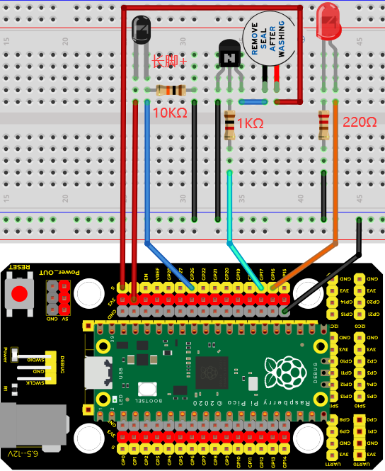

项目代码：（注意：代码中的阀值500可以根据实际情况自己重新设置）

项目现象：

项目代码上传成功后，利用USB线上电，可以看到的现象是：当火焰传感器检测到火焰时，LED闪烁，蜂鸣器报警；否则，LED不亮，蜂鸣器不响。

### 项目 24：小夜灯

项目介绍：

传感器或元件在我们的日常生活中是无处不在的。例如，一些公共路灯在晚上会自动亮起，而在白天会自动熄灭。为什么呢?
事实上，这些都是利用了一种光敏元件，可以感应外部环境光强度的元件。晚上，当室外亮度降低时，路灯会自动打开；到了白天，路灯会自动关闭。这其中的原理是很简单的，在本实验中我们使用树莓派Pico板控制LED就来实现这个路灯的效果。

项目元件：

||||||
|-|-|-|-|-|
|树莓派Pico板*1|树莓派Pico板的扩展板*1|光敏电阻*1|红色 LED*1|10KΩ电阻*1|
||||||
|面包板*1|公对母杜邦线若干|跳线若干|USB 线*1|220Ω电阻*1|

元件知识：

光敏电阻：是一种感光电阻，其原理是光敏电阻表面上接收亮度(光)降低电阻，光敏电阻的电阻值会随着被探测到的环境光的强弱而变化。有了这个特性，我们可以使用光敏电阻来检测光强。光敏电阻及其电子符号如下

下面的电路是用来检测光敏电阻电阻值的变化：

在上述电路中，当光敏电阻的电阻因光强的变化而改变时，光敏电阻与电阻R2之间的电压也会发生变化。因此，通过测量这个电压就可以得到光的强度。

读取光敏电阻的ADC值和电压值：

我们首先用一个简单的代码来读取光敏电阻模拟值，并将其打印出来。接线请参照以下接线图：

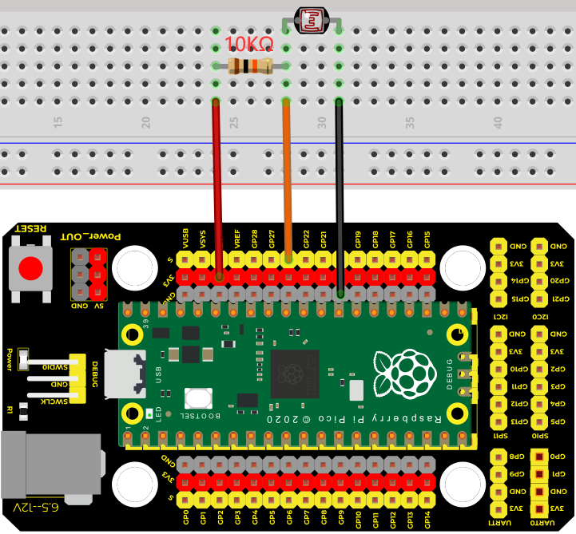

上传代码成功之后，利用USB线上电，打开串口监视器，设置波特率为115200。可以看到的现象是：串口监视器窗口将打印光敏电阻读取的模拟值，当逐渐减弱光敏电阻所处环境中的光线强度时，模拟值逐渐增大；反之，模拟值逐渐减小。

光控灯的电路图和接线图：

我们在前面做了一个小小的调光灯，现在我们来做一个光控灯。它们的原理是相同的，即通过树莓派Pico板获取传感器的模拟值，然后调节LED的亮度。

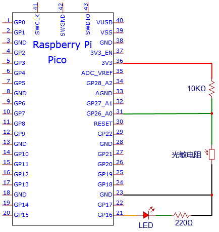

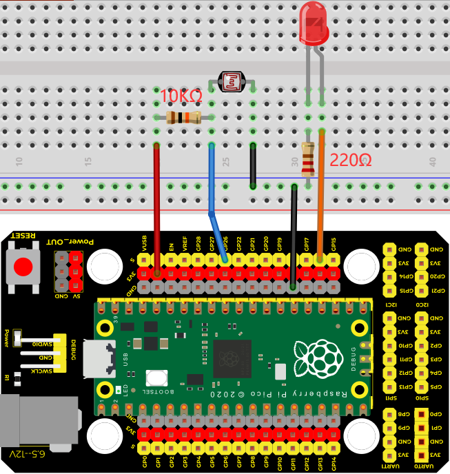

项目代码：

项目结果：

项目代码上传成功后，利用USB线上电，可以看到的现象是：当减弱光敏电阻所处环境中的光线强度时，LED变亮，反之，LED变暗。

### 项目 25：人体感应灯

项目介绍：

人体感应灯一般都用在黑漆漆的楼道区域，随着科技的发展，人体感应灯的使用在我们现实生活中十分常见。小区的楼道，房间的卧室、地下城的车库、卫生间等区域都会用到人体感应灯。现实生活中的人体感应灯一般是由人体红外传感器、灯、光敏电阻传感器等组成的。

在本项目中，我们将学习如何利用人体红外传感器、LED、光敏电阻来制作一款人体感应灯。

项目元件：

|||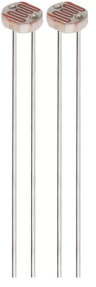||
|-|-|-|-|
|树莓派Pico板*1|树莓派Pico板的扩展板*1|光敏电阻*1|红色LED*1|
|||||
|面包板*1|220Ω电阻*1|公对母杜邦线若干|跳线若干|
|||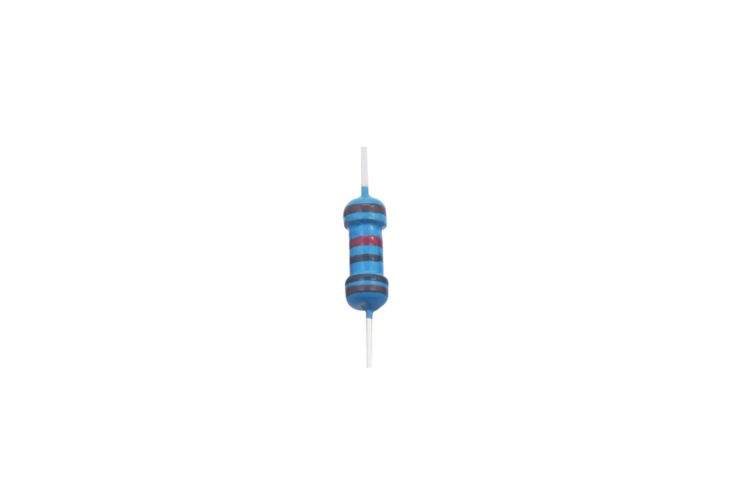||
|人体红外传感器*1|3Pin 杜邦母单*1|10KΩ电阻*1|USB 线*1|

项目电路图和接线图：

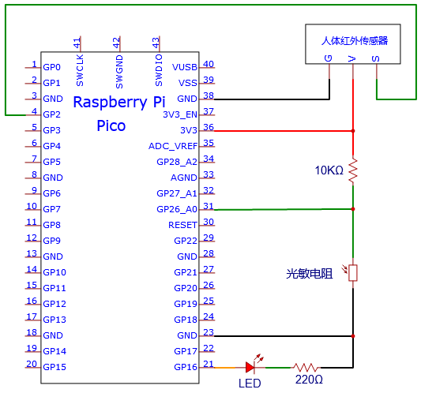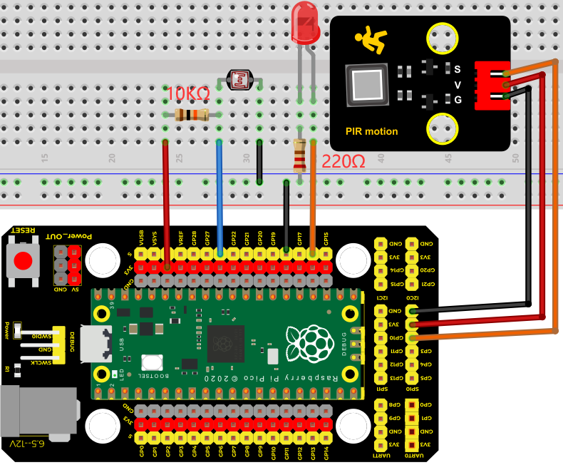

项目结果：

项目代码上传成功后，利用USB线上电，可以看到的现象是：当你的手覆盖光敏电阻的感光部分来模拟黑暗状态时，树莓派Pico板内置的LED点亮，然后用另一只手在人体红外传感器前面晃动，外接LED也点亮，而且手停止晃动后过一会儿外接LED会自动关闭。如果光敏电阻的感光部分没有被覆盖，我们可以看到树莓派Pico板内置的LED灯熄灭了，这时候，用手在人体红外传感器前面晃动，外接LED处于熄灭状态。

### 项目 26：摇杆控制RGB灯

项目介绍：

摇杆模块是一个有两个模拟输入和一个数字输入的组件。广泛应用于游戏操作、机器人控制、无人机控制等领域。在这个项目中，我们使用树莓派Pico板和摇杆模块控制RGB。这样，你可以在实践中对摇杆模块的原理和操作有更深入的了解。 

项目元件：

||||
|-|-|-|
|树莓派Pico板*1|树莓派Pico板的扩展板*1|摇杆模块*1|
||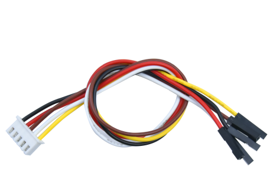|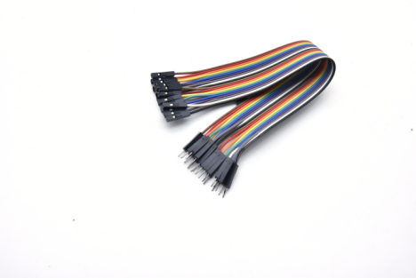|
|RGB LED*1|5P 转杜邦母单*1|公对母杜邦线若干|
||||
|220Ω电阻*3|USB 线*1|面包板*1|

元件知识：

摇杆模块：主要是采用PS2
手柄摇杆元件，实际上摇杆模块有3个信号端引脚，模拟3维空间，摇杆模块的引脚分别是GND、VCC、信号端（B、X、Y），其中信号端X、Y模拟空间的X轴和Y轴，控制时，模块的X、Y信号端是连接单片机模拟口，通过控制2个模拟输入值来控制物体在空间X、Y轴的坐标。信号端B模拟空间Z轴，它一般是接数字口，做按键使用。

VCC接单片机电源输出端V/VCC（3.3/5V），GND接单片机G/GND，原始状态下读出电压大约为1.65V/2.5V左右，对于X轴方向，当随箭头方向逐渐按下，读出电压值随着增加，且可以达到最大电压，随箭头相反方向逐渐按下，读出电压值逐渐减少，减少到最小电压；对于Y轴方向，当沿着模块上的箭头方向逐渐按下，读出电压值逐渐减少，减少到最小电压，随箭头相反方向逐渐按下，读出电压值随着增加，且可以达到最大电压；对于Z轴方向，信号端B接数字口，原始状态下输出0，按下输出1。这样，我们可以读取两个模拟值和一个数字口的高低电平情况，判断模块上摇杆的工作状态。

模块参数：

输入电压：DC 3.3V ~ 5V

输出信号：X/Y双轴模拟值+Z轴数字信号

适用范围：适用于控制点坐标在平面内的运动，双自由度舵机的控制等。

产品特点：外观精美，摇杆手感优越，操作简单，反应灵敏，使用寿命长。

读取摇杆模块的值：

我们必须使用树莓派Pico板的模拟IO口从摇杆模块的X/Y引脚读取数据，并使用数字IO口读取按钮。请按照下面的接线图进行接线：

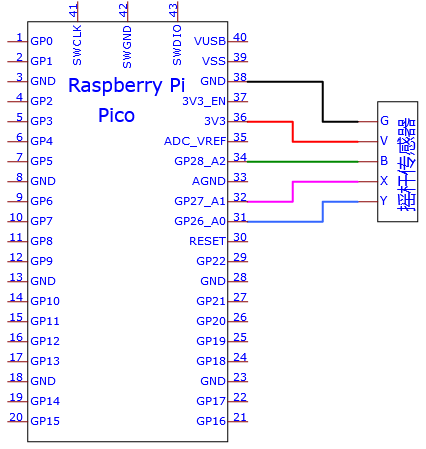

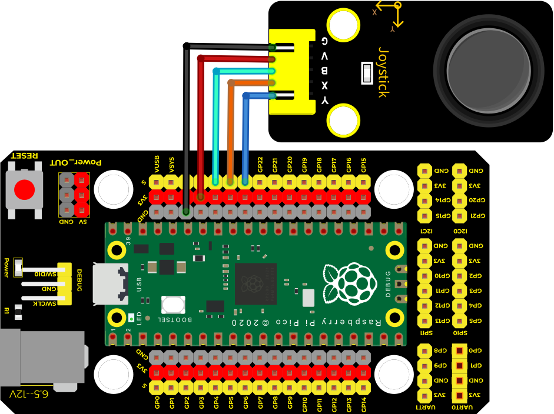

代码上传到树莓派Pico板成功之后，利用USB线上电，打开串口监视器，设置波特率为115200。可以看到的现象是：串口监视器窗口将打印当前摇杆的模拟值和数字值，移动摇杆或按下它将改变串口监视器窗口中的模拟值和数字值。

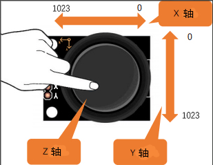
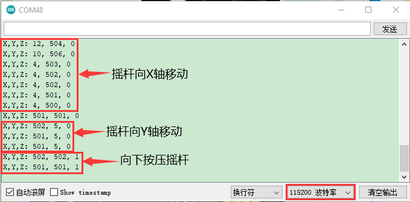

摇杆模块控制RGB的电路图和接线图：

我们刚读了摇杆模块的值，这里我们需要用摇杆模块和RGB做一些事情，按照下图连接：

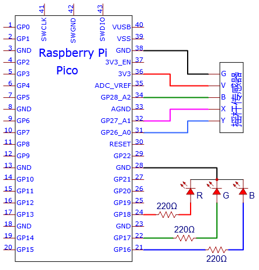

项目代码：

项目现象：

项目代码上传成功后，利用USB线上电，可以看到的现象是：①如果摇杆在X方向上移动到最左边，RGB光变成红色;
②如果摇杆在X方向上移动到最右边，RGB光变为绿色;
③如果摇杆在Y方向上移动到最上面，RGB光变成白色;
④如果摇杆在Y方向上移动到最下面，RGB光变成蓝色。

### 项目 27：温湿度表

项目介绍：

在冬季时，空气中的湿度很低，就是空气很干燥，再加上寒冷，人体的皮肤就容易过于干燥而裂，所以需要在用加湿器给家里的空气增加湿度，但是怎么知道空气过于干燥了呢？那就需要检测空气湿度的设备，这节课就来学习温湿度传感器的使用。我们使用温湿度传感器制作一个温湿度计，并且还结合LCD 128X32 DOT来显示温度和湿度值。

项目元件：

|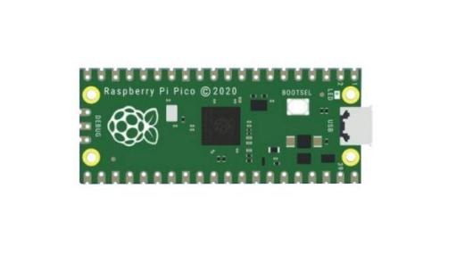||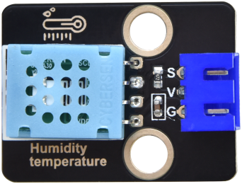||
|-|-|-|-|
|树莓派Pico板*1|树莓派Pico板的扩展板*1|温湿度传感器*1|LCD 128X32 DOT*1|
|||||
|4P 转杜邦线母单10厘米*1|3Pin 杜邦母单*1|USB 线*1||

元件知识：

温湿度传感器：是一款含有已校准数字信号输出的温湿度复合传感器，其精度湿度±5%RH，
温度±2℃，量程湿度20-90%RH，
温度0~50℃。温湿度传感器应用专用的数字模块采集技术和温湿度传感技术，确保产品具有极高的可靠性和卓越的长期稳定性。温湿度传感器包括一个电阻式感湿元件和一个NTC测温元件，非常适用于对精度和实时性要求不高的温湿度测量场合。

工作电压在3.3V-5.5V范围内。  
温湿度传感器有三个引脚，分别为VCC，GND和S。S为数据输出的引脚。使用的是串行通讯。

温湿度传感器的单总线格式定义：

|名称|单总线格式定义|
|-|-|
|起始信号|微处理器把数据总线(SDA)拉低一段时间至少 18ms(最大不得超过30ms)，通知传感器准备数据。|
|响应信号|传感器把数据总线（SDA）拉低 83µs，再接高 87µs以响应主机的起始信号。|
|湿度|湿度高位为湿度整数部分数据，湿度低位为湿度小数部分数据|
|温度|温度高位为温度整数部分数据，温度低位为温度小数部分数据，且温度低位Bit8 为 1 则表示负温度，否则为正温度|
|校验位|校验位＝湿度高位+湿度低位+温度高位+温度低位|

温湿度传感器数据时序图：

用户主机（MCU）发送一次开始信号后，温湿度传感器从低功耗模式转换到高速模式，待主机开始信号结束

后，温湿度传感器发送响应信号，送出 40bit
的数据，并触发一次信采集。信号发送如图所示。

结合代码，可以理解的更好。

温湿度传感器可以很容易地将温湿度数据添加到您的DIY电子项目中。它是完美的远程气象站，家庭环境控制系统，和农场或花园监测系统。

温湿度传感器的参数：

工作电压：+5 V

温度范围：0-50 °C ，误差：± 2 °C

湿度范围：20-90% RH ，误差：± 5% RH

数字接口

温湿度传感器的原理图：

读取温湿度值：

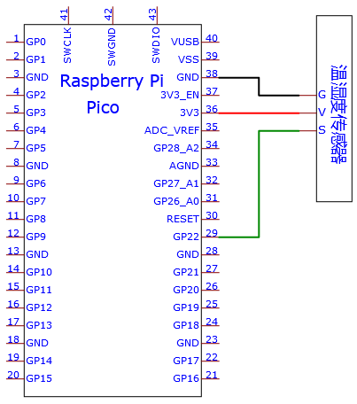

怎样添加DHT库：

打开Arduino IDE，单击“项目”→“加载库”→“添加 .ZIP
库...”。在弹出窗口中找到该目录下名为：4. Arduino 教程\1. Windows 系统\3.
库文件\DHT.ZIP的文件。先单击“DHT.ZIP”文件，再单击“打开”。

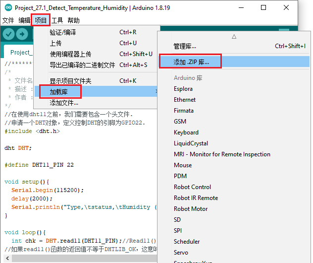

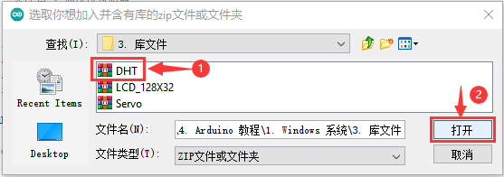

DHT库添加完之后，你可以打开我们提供的代码：

代码上传到树莓派Pico板成功之后，利用USB线上电，打开串口监视器，设置波特率为115200。可以看到的现象是：串口监视器窗口将打印当前显示当前环境中的温湿度数据，如下图。

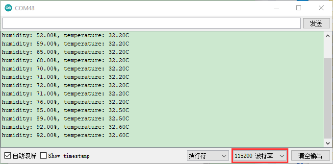

温湿度仪表的电路图和接线图：

现在我们开始用LCD_128X32_DOT打印温湿度传感器的值，我们会在LCD_128X32_DOT的屏幕上看到相应的值。让我们开始这个项目吧。请按照下面的接线图进行接线：

特别注意：这里必须使用4P
转杜邦线母单10厘米连接LCD_128X32_DOT，LCD_128X32_DOT才会显示正常；否则，使用4P
转杜邦线母单20厘米，LCD_128X32_DOT可能会显示不正常。

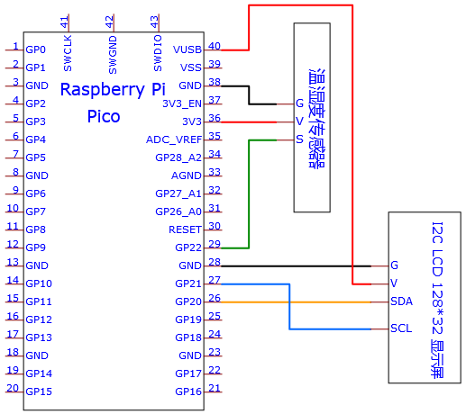

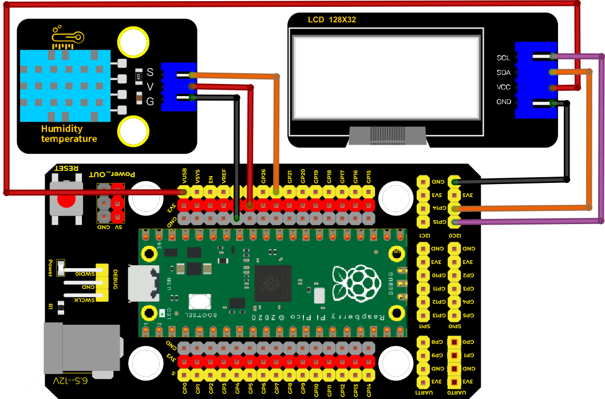

项目代码：

前面已经添加过DHT和lcd128_32_io库，可以不用重复添加。如果没有添加，就需要添加DHT和lcd128_32_io库，添加DHT库的方法请参照本项目的上面方法，添加lcd128_32_io库的方法请参照项目
17：I2C 128×32 LCD中的方法。

DHT和lcd128_32_io库添加完成后，你可以打开我们提供的代码：

项目现象：

项目代码上传成功后，利用USB线上电，你会看到的现象是：LCD 128X32 DOT的屏幕上显示温湿度传感器检测环境中相应的温度值和湿度值。

### 项目 28：测距仪表

项目介绍：        HC-SR04超声波传感器是一种非常实惠的距离传感器，主要用于各种机器人项目中的物体躲避。它也被用于水位传感，甚至作为一个停车传感器。我们把超声波传感器当作蝙蝠的眼睛，在黑暗中，蝙蝠仍然可以通过超声波识别前方的物体和方向。在本项目中，我们使用树莓派Pico板控制超声波传感器和LED模拟超声波测距仪。

项目元件：

|||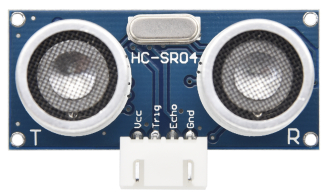||
|-|-|-|-|
|树莓派Pico板*1|树莓派Pico板的扩展板*1|超声波传感器*1|公对母杜邦线若干|
|||||
|4P 转杜邦线母单20厘米*1|220Ω电阻*4|跳线若干|红色LED*4|
|||||
|面包板*1|USB 线*1|||

元件知识：

HC-SR04超声波传感器：像蝙蝠一样使用声纳来确定与物体的距离，它提供了精准的非接触范围检测，高精度和稳定的读数。它的操作不受阳光或黑色材料的影响，就像精密的照相机(在声学上像布料这样比较软的材料很难被探测到)。它带有超声波发射器和接收器。

在超声波传感器的前面是两个金属圆筒，这些是转换器。转换器将机械能转换成电信号。在超声波传感器中，有发射转换器和接收转换器。发射转换器将电信号转换为超声波脉冲，接收转换器将反射的超声波脉冲转换回电信号。如果你看超声波传感器的背面，你会看到的发射转换器后面有一个IC。这是控制发射转换器的IC。在接收转换器后面也有一个IC，这是一个四运算放大器，它将接收转换器产生的信号放大成足以传输到微控制器的信号。

时序图：

图示HC-SR04的时序图。为了开始测量，SR04的Trig必须接受至少10us的高(5V)脉冲，这将启动传感器将发射出8个周期的40kHz的超声波脉冲，并等待反射的超声波脉冲。当传感器从接收器检测到超声波时，它将设置回波引脚为高(5V)和延迟一个周期(宽度)，与距离成比例。为了获得距离，测量Echo引脚的宽度。

时间=回波脉冲宽度，单位为us(微秒)

距离厘米=时间/ 58

距离(英寸)=时间/ 148

读取超声波传感器距离值

我们将从一个简单的超声波测距开始，并打印测量的距离。

HC-SR04超声波传感器有四个引脚：Vcc、Trig、Echo和GND。Vcc引脚提供产生超声波脉冲的电源，接Vcc/+5V。GND引脚接地/GND。Trig引脚是控制板发送信号来启动超声波脉冲的地方。Echo引脚是超声波传感器向控制板发送关于超声波脉冲行程持续时间的信息的地方。按下图接线：

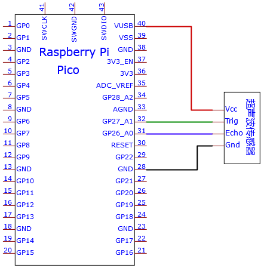

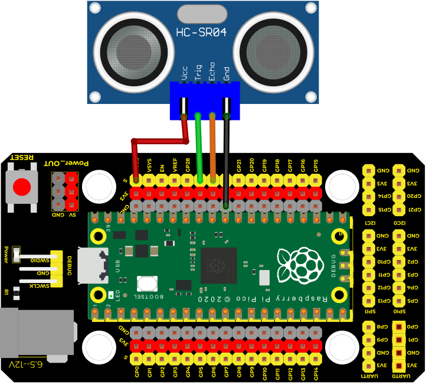

上传代码成功之后，利用USB线上电，打开串口监视器，设置波特率为115200。可以看到的现象是：串口监视器窗口将打印超声波传感器和物体之间的距离值。

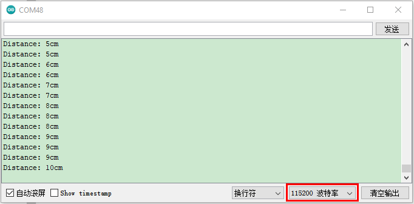

超声波测距仪的电路图和接线图：

接下来，我们将使用树莓派Pico板控制超声波传感器和4个LED模拟超声波测距仪。按如下图接好线：

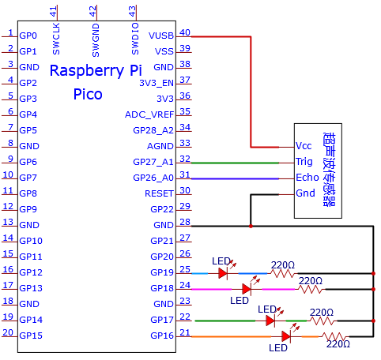

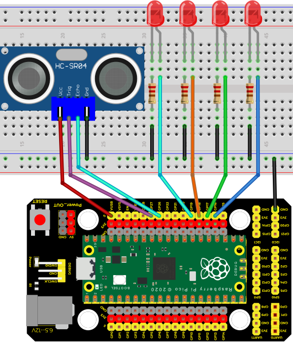

项目现象：

项目代码上传成功后，利用USB线上电，打开串口监视器，设置波特率为115200。可以看到的现象是：串口监视器窗口将打印超声波传感器和物体之间的距离值，另外，当我们用手在超声波传感器前移动时，相应的LED会亮起来。

### 项目 29：温度仪表

项目介绍：

热敏电阻是一种电阻，其阻值取决于温度和温度的变化，广泛应用于园艺、家庭警报系统等装置中。因此，我们可以利用这一特性来制作温度计。

项目元件：

||||
|-|-|-|
|树莓派Pico板*1|树莓派Pico板的扩展板*1|公对母杜邦线若干|
||||
|LCD_128X32_DOT*1|面包板*1|热敏电阻*1|
||||
|4P 转杜邦线母单10厘米*1|USB 线*1|10KΩ电阻*1|

元件知识：

热敏电阻：热敏电阻是一种温度敏感电阻。当热敏电阻感应到温度的变化时，它的电阻就会发生变化。我们可以利用热敏电阻的这种特性来检测温度强度。热敏电阻及其电子符号如下所示。

热敏电阻的电阻值与温度的关系为：

式中：

Rt为热敏电阻在T2温度下的电阻；

R为热敏电阻在T1温度下的标称阻值；

EXP\[n\]是e的n次幂；

B为温度指数；

T1，T2是开尔文温度(绝对温度)，开尔文温度=273.15     +摄氏温度。对于热敏电阻的参数，我们使用：B=3950,     R=10KΩ，T1=25℃。热敏电阻的电路连接方法与光敏电阻类似，如下所示：

我们可以利用ADC转换器测得的值来得到热敏电阻的电阻值，然后利用公式来得到温度值。因此，温度公式可以推导为：

读取热敏电阻的值：

首先我们学习了热敏电阻读取当前的ADC值、电压值和温度值，并将其打印出来。请按下面的接线图接好线：

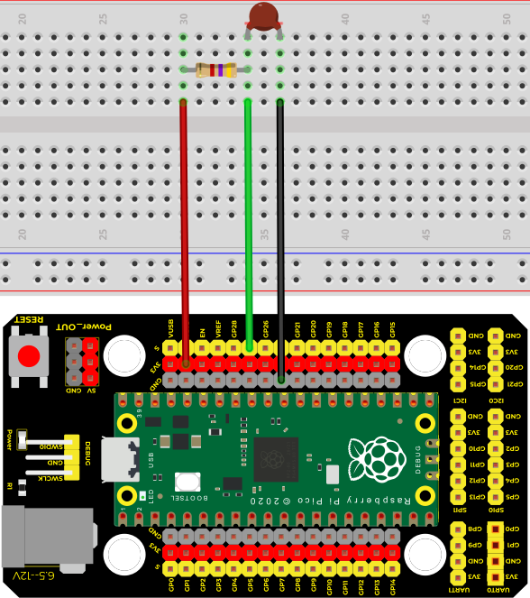

代码上传到树莓派Pico板成功之后，利用USB线上电，打开串口监视器，设置波特率为115200。你会看到的现象是：串口监视器窗口将不断显示热敏电阻当前的电压值和温度值。试着用食指和拇指捏一下热敏电阻(不要碰触导线)一小段时间，你应该会看到温度值增加。

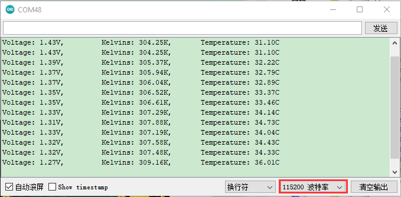

温度仪表电路图和接线图：

特别注意：这里必须使用10CM短公对母杜邦线连接LCD_128X32_DOT，LCD_128X32_DOT才会显示正常；否则，使用20CM长公对母杜邦线，可能会导致LCD_128X32_DOT显示不正常。

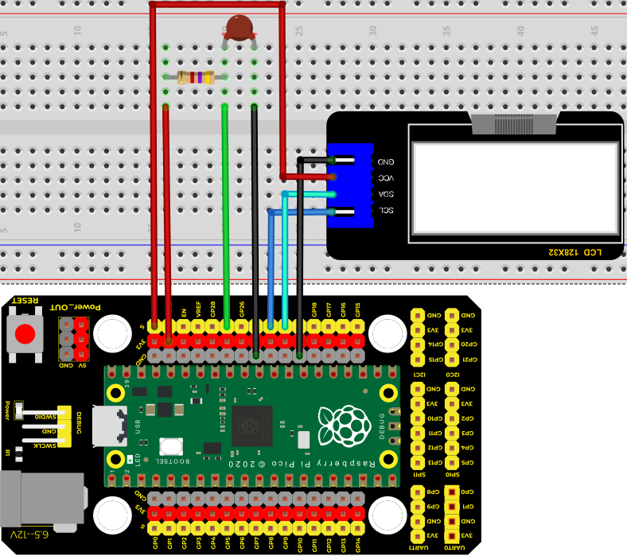

添加lcd128_32_io库：

前面已经添加过lcd128_32_io库，可以不用重复添加。如果没有添加，就需要添加lcd128_32_io库，添加第三方库的步骤如下:

打开Arduino IDE，单击“项目”→“加载库”→“添加 .ZIP
库...”。在弹出窗口中找到该目录下名为：4. Arduino 教程\1. Windows 系统\3.
库文件\LCD_128X32.ZIP的文件，先选中LCD_128X32.ZIP文件，再单击“打开”。

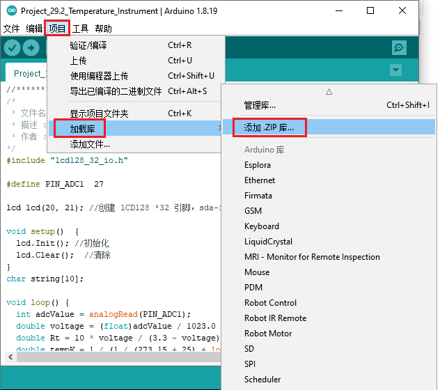

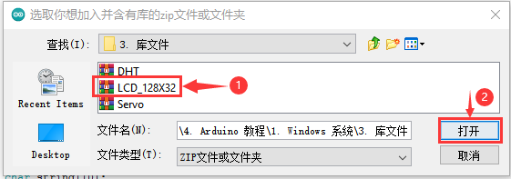

项目代码：

lcd128_32_io库添加完成后，你可以打开我们提供的代码：

项目现象：

项目代码上传成功后，利用USB线上电，你会看到的现象是：LCD 128X32 DOT的屏幕上显示热敏电阻的电压值和当前环境中的温度值。

### 项目 30：键盘控制门

 项目介绍：

常用的数字按钮传感器，一个按钮就使用一个IO口，而有时我们需要的按钮比较多时，就会占用过多的IO口，为了节省IO口的使用，把多个按钮做成了矩阵类型，通过行列线的控制，实现少IO口控制多个按钮。在本项目中，我们将来学习树莓派Pico板和薄膜4\*4矩阵键盘控制舵机和蜂鸣器。

项目元件：

|||||
|-|-|-|-|
|树莓派Pico板*1|树莓派Pico板的扩展板*1|舵机*1|有源蜂鸣器*1|
|||||
|薄膜4*4矩阵键盘*1|跳线若干|面包板*1|公对母杜邦线若干|
|||||
|NPN型晶体管(S8050)*1|1kΩ电阻*1|USB 线*1||

元件知识：

4\*4矩阵键盘：键盘是一种集成了许多键的设备。如下图所示，一个4x4键盘集成16个键。

与LED矩阵集成一样，在4x4键盘中，每排键都是用一根引脚连接，每一列键都是一样的。这样的连接可以减少处理器端口的占用。内部电路如下所示。

使用方法类似于矩阵LED，即使用行扫描或列扫描方法检测每列或每行上的键的状态。以列扫描法为例，向第4列(Pin4)发送低电平，检测第1、2、3、4行电平状态，判断A、B、C、D键是否按下。然后依次将低电平发送到列3、2、1，检测是否有其它键被按下。然后，你可以获得所有键的状态。

读取4\*4矩阵键盘的键值：

我们首先使用一个简单的代码读取4\*4矩阵键盘的键值，并将其打印出来，其接线图如下所示：

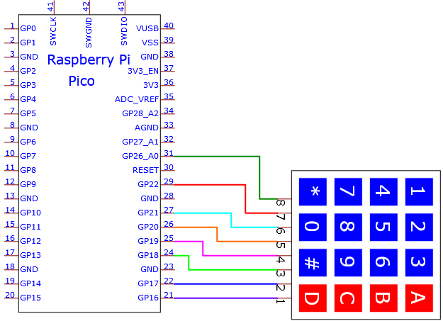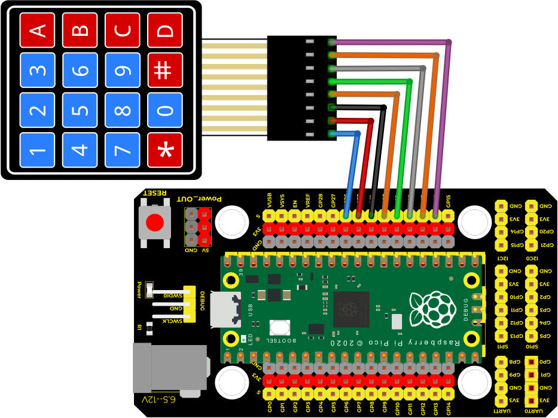

上传代码成功之后，利用USB线上电，打开串口监视器，设置波特率为115200。可以看到的现象是：按下键盘，串口监视器窗口将打印对应的键值，如下图所示。

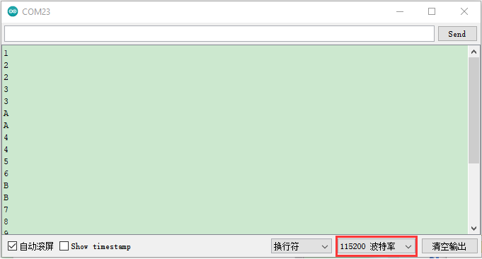

Keypad Door的电路图和接线图：

我们使用4\*4矩阵键盘作为键盘来控制舵机和蜂鸣器。

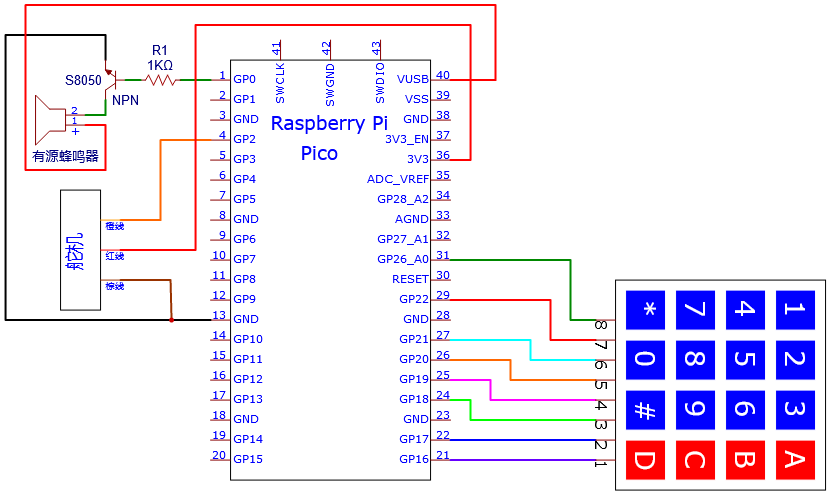

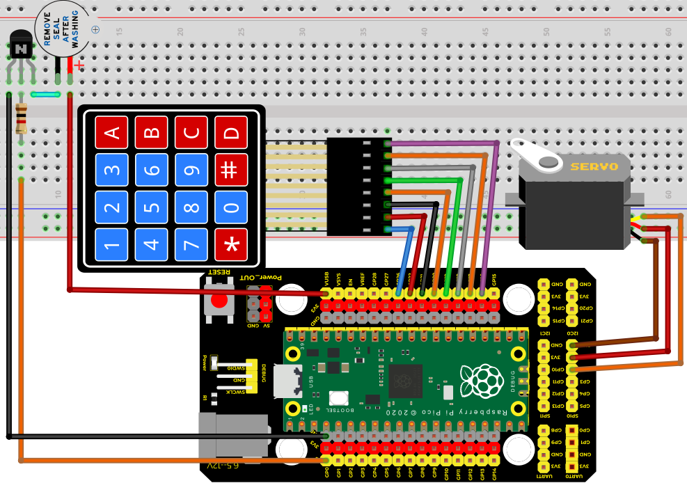

项目现象：

项目代码上传成功后，利用USB线上电，你会看到的现象是：按键盘输入4个字符的密码，如果输入正确（正确密码：1234），舵机会转动一定角度，然后回到原来的位置。如果输入错误，将发出输入错误警报。

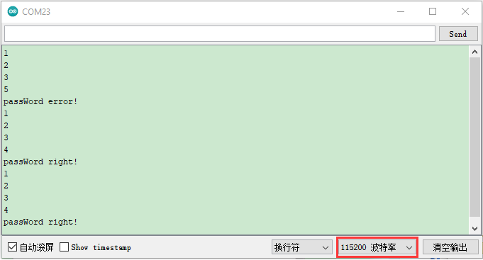

Keypad.cpp

### 项目 31：红外遥控控制声音和LED

项目介绍：

红外遥控是一种低成本、易于使用的无线通信技术。IR光与可见光非常相似，除了它的波长稍长一点。这意味着红外线是人眼无法检测到的，这对于无线通信来说是完美的。例如，当你按下电视遥控器上的一个按钮时，一个红外LED会以每秒38000次的频率反复开关，将信息(如音量或频道控制)传送到电视上的红外感光器。

我们将首先解释常见的红外通信协议是如何工作的。然后我们将从一个遥控器和一个红外接收组件开始这个项目。

项目元件：

||||||
|-|-|-|-|-|
|树莓派Pico板*1|树莓派Pico板的扩展板*1|红外接收器 *1|RGB LED*1|220Ω电阻*3|
|||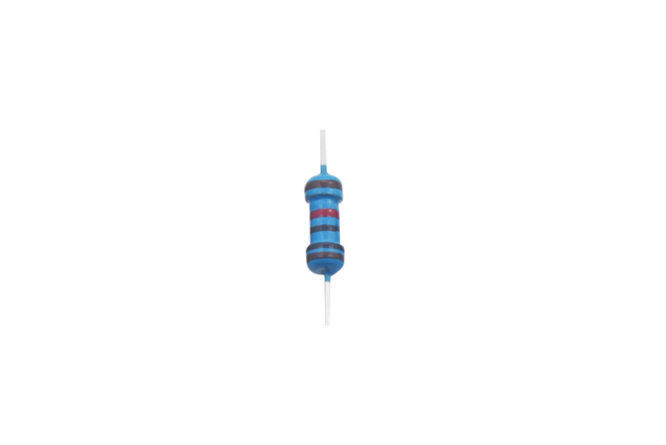|||
|红外遥控器*1|无源蜂鸣器*1|10KΩ电阻*1|跳线若干|USB 线*1|
||||||
|面包板*1|NPN型晶体管(S8050)*1|1kΩ电阻*1|公对母杜邦线若干||

元件知识：

红外(IR)遥控器：是一种具有一定数量按钮的设备。按下不同的按钮会使位于遥控器前端的红外发射管以不同的编码发送红外信号。红外遥控技术应用广泛，如电视、空调等。因此，在当今科技发达社会，红外遥控技术使你切换电视节目和调节空调温度都很方便。

我们使用的遥控器如下所示：

该红外遥控器采用NEC编码，信号周期为110ms。

红外(IR)接收器：它是一种元件，可以接收红外光，所以可以用它来检测红外遥控器发出的红外光信号。红外接收器解调接收到的红外光信号，并将其转换回二进制，然后将信息传递给微控制器。

红外信号调制过程图：

解码红外信号：

我们按照下面接线图将红外接收元件连接到树莓派Pico板。

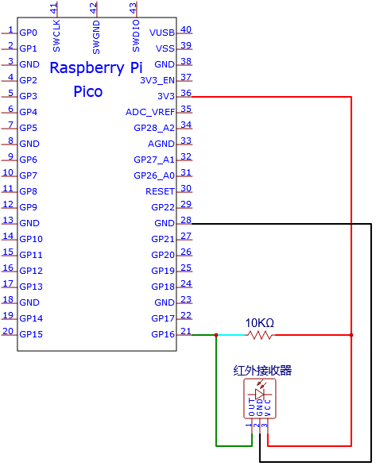

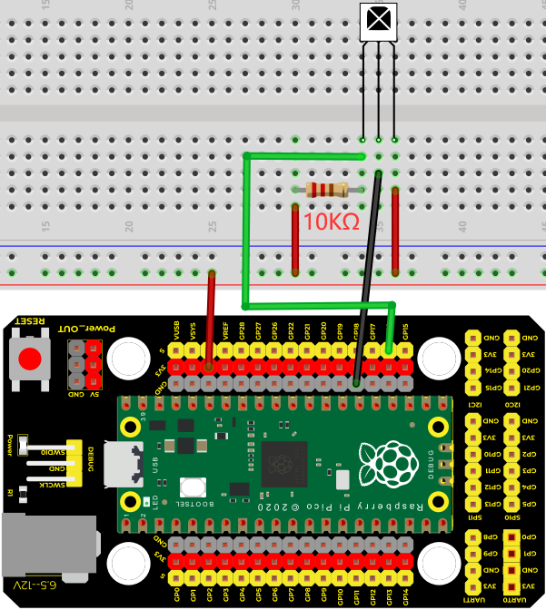

代码上传到树莓派Pico板成功之后，利用USB线上电，打开串口监视器，设置波特率为115200。可以看到的现象是：将红外遥控器发射器对准红外接收头，按下红外控制器上的按键，串口监视器窗口将打印当前接收到的按键编码值。

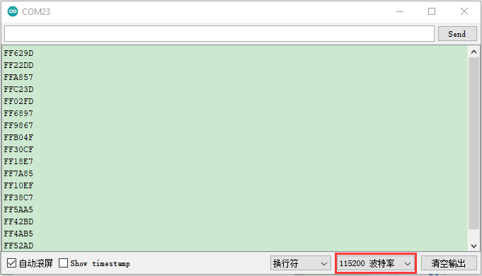

写下红外遥控器与每个按键相关联的按键编码值，因为你稍后将需要这些信息。

 红外遥控的电路图和接线图：

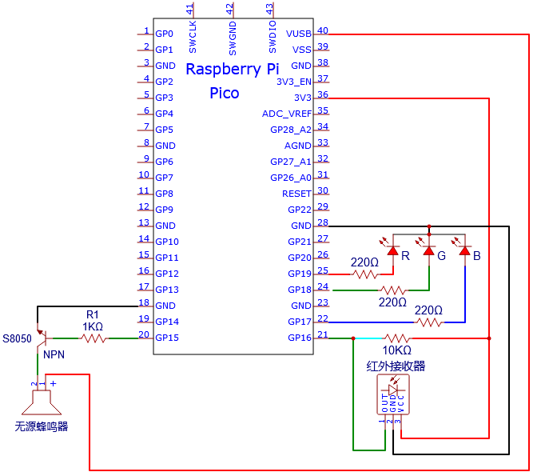

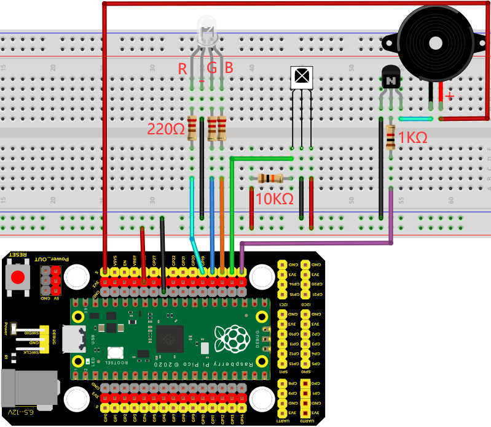

项目现象：

项目代码上传成功后，利用USB线上电，你会看到的现象是：按红外遥控器的1~7键，可以听到do、re、mi、fa、sol、la、si等蜂鸣器的声音，同时RGB分别亮红灯，绿灯，蓝灯，黄灯，洋红灯，蓝绿灯，白灯。按其他另一按键（除1-7键以外），蜂鸣器就停止播放，RGB熄灭。

(注意:在使用前，我们需要将红外遥控器底部的塑料片去掉)

IR.cpp

### 项目 32：WiFi 测试

.实验简介：

ESP8266串口WiFi ESP-01模块，它是一款超低功耗的UART-WiFi     透传模块，拥有业内极富竞争力的封装尺寸和超低能耗技术，专为移动设备和物联网应用设计，可将用户的物理设备连接到Wi-Fi     无线网络上，进行互联网或局域网通信，实现联网功能。

实验元件：

||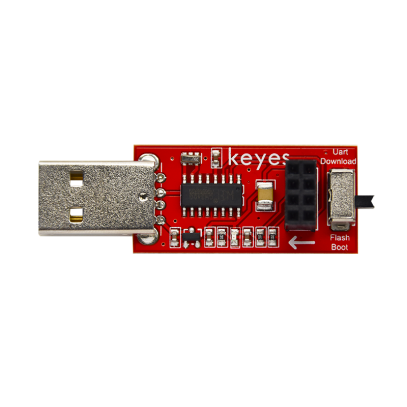|
|-|-|
|ESP8266串口WiFi ESP-01*1|USB转ESP-01S WiFi模块串口测试扩展板*1|

元件知识：

USB转ESP-01S WiFi模块串口测试扩展板：适用于ESP-01S WiFi模块，扩展板的拨动开关打到flash boot端，直插于电脑USB口，用安信可串口调试助手测试AT指令。

扩展板的拨动开关打到Uart Download
端，直插于电脑USB口，ESP-01模块处于下载模式，通过安信可固件下载软件可下载固件到ESP-01模块中。

ESP8266串口WiFi ESP-01：ESP8266串口WiFi ESP-01是一款超低功耗的UART-WiFi 透传模块，ESP8266串口WiFi ESP-01可广泛应用于智能电网、智能交通、智能家具、手持设备、工业控制等领域。

将WIFI模块串口测试扩展板插入电脑的USB口：

将ESP8266串口WIFI ESP-01模块正确方向插入USB转ESP-01S     WIFI模块串口测试扩展板上。

先将USB转ESP-01S     WIFI模块串口测试扩展板上的拨码开关拨到UartDownload端，再将USB转ESP-01S     WIFI模块串口测试扩展板插入电脑的USB口。

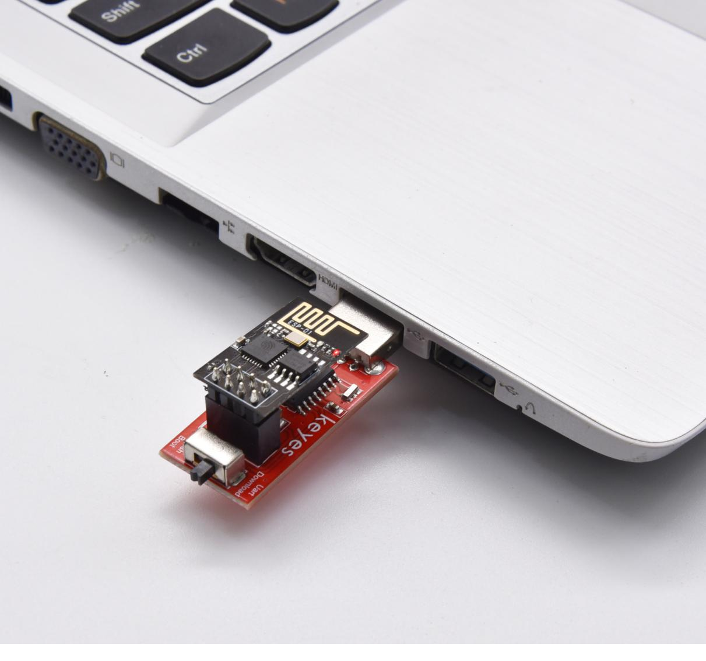

安装驱动文件

这个USB转ESP-01S     WIFI模块串口测试扩展板的USB转串口芯片为CH340，我们需要安装这芯片的驱动，驱动为usb_ch341_3.1.2009.06，我们把该驱动文件放到D盘（即：复制放到D盘），然后开始安装驱动。在不同系统在安装驱动方式大同小异，这里我们在win10系统上开始安装驱动。

当USB转ESP-01S WIFI模块串口测试扩展板第一次接入你的电脑,     右击桌面上的“我的电脑”—\>“属性”—\>“设备管理器”,     即可看到“USB-Serial”。

点击 “USB-Serial”, 选择“更新驱动程序（P）”。

C.然后点击“浏览计算机以查找驱动程序软件”。

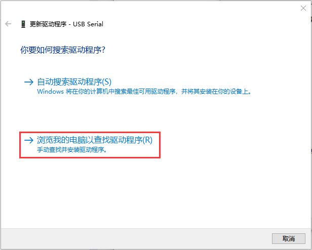

点击“浏览（R）...”找到提供的““usb_ch341_3.1.2009.06””驱动文件。(我这里是将“usb_ch341_3.1.2009.06
”文件放D盘，你也可以把驱动文件夹放在方便的地方也行)

安装完成后点击“关闭”。

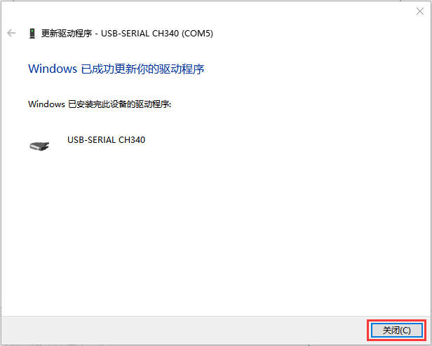

驱动安装完成后右键点击“我的电脑”—\>“属性”—\>“设备管理器”,     你可以看到你CH340驱动程序已经成功安装到电脑，如下图。

Arduino搭建Esp8266开发环境

先将ESP8266串口WIFI ESP-01模块正确插入USB转ESP-01S WIFI模块串口测试扩展板中，然后将USB转ESP-01S WIFI模块串口测试扩展板插入电脑的USB口，点击进入arduino文件夹（也可以采用最新版本的），找到图标并点击进入arduino IDE界面。

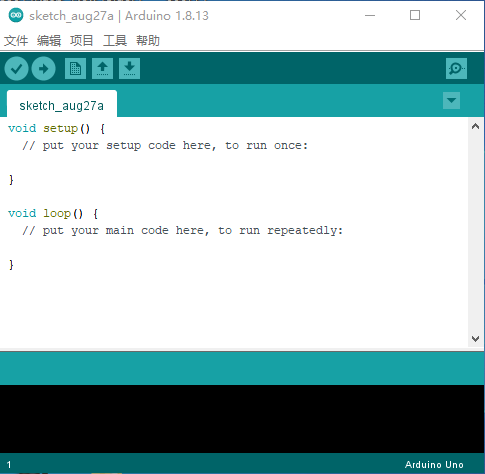

在Arduino IDE里面进行下载安装：

A.点击“文件”
→“首选项”，在“附加开发板管理器网址：”框中复制粘贴这个地址：http://arduino.esp8266.com/stable/package_esp8266com_index.json，然后点击“好”保存这个地址。

先点击“工具”→“开发板：”，再点击“开发板管理器”进入“开发板管理器”页面，IDE会自动下载相关文件，如下图。

在“全部”后空格中输入“ESP8266”，然后点击下面搜索内容，选择最新版本进行安装，安装包不大，点击“安装”开始安装相关插件。如下图。（可能会出现下载安装出错，有可能是服务器原因，需要重新点击“安装”就可以了，但由于网络原因，大多用户可能无法搜到esp8266     by esp8266     Community，对于小白而言不推荐使用此方法添加，推荐下面方法2）

安装成功后点击“关闭”关闭页面，然后点击“工具”→“开发板：”，你可以在里面查看到各种不同型号ESP8266开发板。选择对应的ESP8266开发板型号和COM口，选中后即可对ESP8266进行编程。

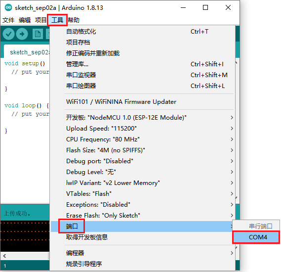

通过工具对ESP8266进行安装：（推荐使用这种方法）

A.点击“文件”
→“首选项”，在“附加开发板管理器网址：”框中复制粘贴这个地址：http://arduino.esp8266.com/stable/package_esp8266com_index.json，然后点击“好”保存这个地址。

B.使用“esp8266一键安装arduino板_2.5.0版.exe”，一键安装，此方法安装便捷，且安装较快，推荐此方法安装。

鼠标左键双击“esp8266一键安装arduino板_2.5.0版.exe”，然后就安装完成了。

在上述工具安装完成之后，重启 Arduino IDE 软件，点击 Arduino
菜单栏“工具”→“开发板：”  ，可查看到各种不同型号ESP8266开发板。选择对应的ESP8266开发板型号和COM口，选中后即可对ESP8266进行编程。

实验代码：

注意：打开IDE后，一定要先设置好ESP8266板型和COM口。手机和设备需要连接在同一个WiFi上，如果家里没有WiFi需要打开手机热点共享WiFi，打开手机热点共享WiFi是最好的方法。

实验现象：

特别注意：需要先将项目代码

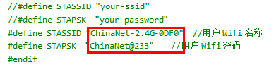

中的用户Wifi名称和用户Wifi密码改成你们自己的Wifi名称和Wifi密码。

Wifi名称和Wifi密码修改后，确保USB转ESP-01S WIFI模块串口测试扩展板上的拨码开关已经拨到Uart Download
端，并且也确定USB转ESP-01S WIFI模块串口测试扩展板已经插入电脑的USB口。然后按照前面方法设置ESP8266板型和COM口，IDE右下角会显示对应的ESP8266板型和COM口，再点击将测试代码上传到ESP8266串口WIFI ESP-01模块上，上传成功。（注意：如果上传失败，在板型和COM口没问题下，将USB转ESP-01S WIFI模块串口测试扩展板从电脑的USB口拔下来再次插到电脑的USB口）

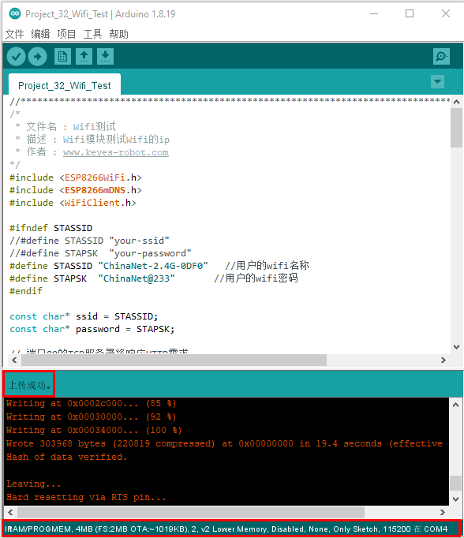

WIFI实验代码上传成功后，先将USB转ESP-01S WIFI模块串口测试扩展板从电脑的USB口拔下来，再将USB转ESP-01S WIFI模块串口测试扩展板上的拨码开关拨到Flash Boot
端，然后再次插到电脑的USB口上。打开串口监视器，设置波特率为115200，即可看到你的WIFI信息，如下图所示：

### 项目 33：WiFi 智能家居

项目介绍：

在前面的项目32中，我们已经知道ESP8266串口WIFI     ESP-01模块通过WiFi测试代码得到相关的WiFi信息。那么在这个实验中，我们将使用ESP8266串口WiFi     ESP-01模块通过APP和WiFi来控制多个传感器/模块工作，实现WiFi智能家居的效果。

项目元件：

|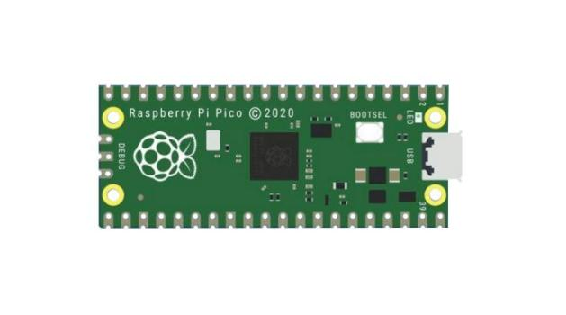||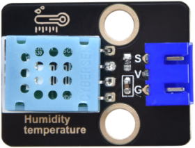|
|-|-|-|
|树莓派Pico板*1|树莓派Pico板的扩展板*1|温湿度传感器*1|
||||
|ESP8266串口WIFI ESP-01*1|USB转ESP-01S WIFI模块串口测试扩展板*1|5V继电器模块*1|
||||
|超声波传感器*1|智能手机/平板电脑*1|公对母杜邦线若干|
||||
|舵机*1|母对母杜邦线若干|USB 线*1|
||||
|面包板*1|4P 转杜邦线母单20厘米*1|3Pin 杜邦母单*2|

 将WIFI模块串口测试扩展板插入电脑的USB口：

将ESP8266串口WIFI ESP-01模块正确方向插入USB转ESP-01S WIFI模块串口测试扩展板上。

先将USB转ESP-01S WIFI模块串口测试扩展板上的拨码开关拨到UartDownload端，再将USB转ESP-01S WIFI模块串口测试扩展板插入电脑的USB口。

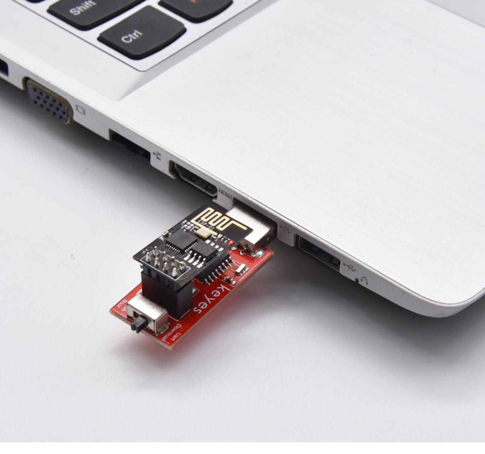

ESP8266 代码：

注意：打开Arduino IDE后，一定要先设置好ESP8266板型和COM口。手机和设备需要连接在同一个WiFi上，如果家里没有WiFi需要打开手机热点共享WiFi，打开手机热点共享WiFi是最好的方法。

特别注意：需要先将项目代码

中的用户Wifi名称和用户Wifi密码改成你们自己的Wifi名称和Wifi密码。

Wifi名称和Wifi密码修改后，确保USB转ESP-01S WiFi模块串口测试扩展板上的拨码开关已经拨到Uart Download
端，并且也确定USB转ESP-01S WIFI模块串口测试扩展板已经插入电脑的USB口。然后按照项目32中的方法设置ESP8266板型和COM口，IDE右下角会显示对应的ESP8266板型和COM口，再点击将ESP8266
代码上传到ESP8266串口WIFI ESP-01模块上，上传成功。（注意：如果上传失败，在板型和COM口没问题情况下，将USB转ESP-01S WIFI模块串口测试扩展板从电脑的USB口拔下来再次插到电脑的USB口）

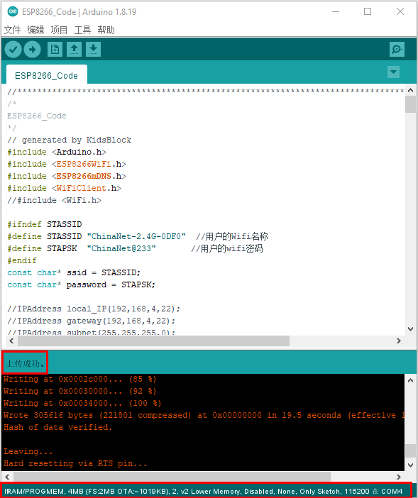

ESP8266 代码上传成功后，先将USB转ESP-01S WiFi模块串口测试扩展板从电脑的USB口拔下来，再将ESP8266串口WIFI ESP-01模块从USB转ESP-01S WiFi模块串口测试扩展板上拔下来。

项目接线：

|继电器|树莓派Pico板的扩展板|温湿度传感器|树莓派Pico板的扩展板|
|-|-|-|-|
|G|G|G|G|
|V|5V|V|3V3|
|S|GP27|S|GP2(S)|
|超声波传感器|树莓派Pico板的扩展板|舵机|树莓派Pico板的扩展板|
|Vcc|5V|红线|3V3|
|Trig|GP17|棕线|G|
|Echo|GP16|橙黄线|GP9(S)|
|Gnd|G|||
|Wifi 模块|树莓派Pico板的扩展板|||
|3V3|3V3|||
|EN/CP|3V3|||
|TX|RX(GP1)|||
|RX|TX(GP0)|||
|GND|GND||||

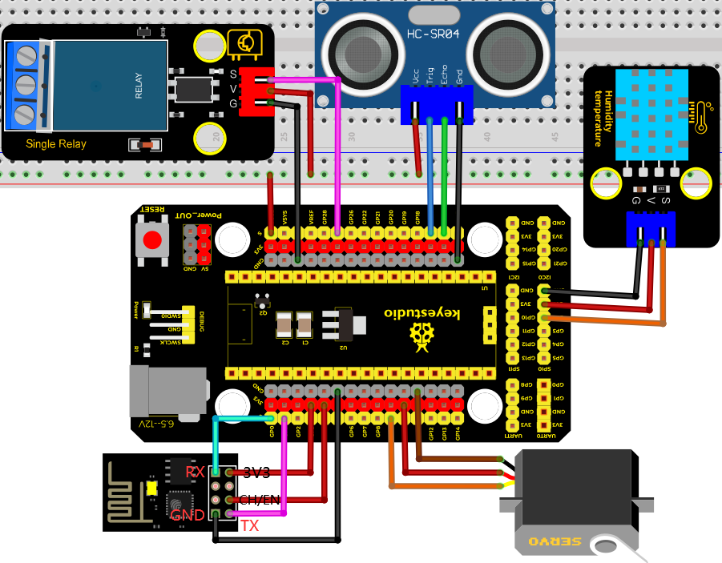

WiFi Smart Home项目代码：

注意：打开Arduino IDE后，一定要先设置好树莓派Pico板的板型和COM口。如果家里没有WiFi需要打开手机热点共享WiFi.

 实现现象：

特别注意：上传项目代码前，需要先将连接到树莓派Pico板的扩展板上的TX和RX的杜邦线先拔下来，要不然代码上传可能不成功。

然后点击Arduino IDE菜单栏的"工具" →
"开发板："，选择“Raspberry Pi Pico”，选择正确的COM端口，最后将WiFi
智能家居项目代码上传至树莓派Pico板。上传代码成功后，再将接在ESP8266串口WIFI ESP-01模块上的TX杜邦线另一端接到树莓派Pico板的扩展板上的RX(GP1)引脚，RX的杜邦线另一端接到树莓派Pico板的扩展板上的TX(GP0)引脚。点击打开串口监视器窗口，将波特率设置为9600。这样，串口监视器就显示此时你们WiFi的IP地址。（WiFi的IP地址有时候会改变，如果原来的IP地址不行，需要重新检测WiFi的IP地址）

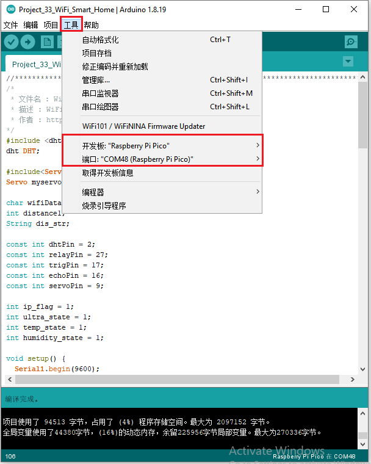

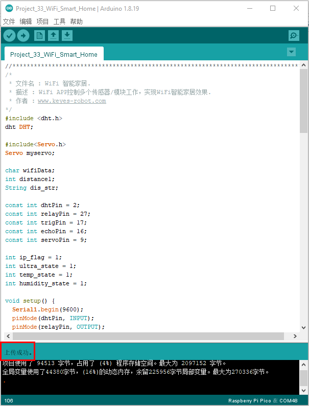

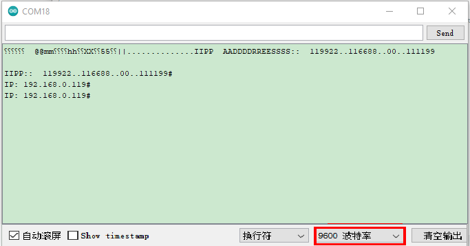

安卓系统设备（手机/iPad）APP：

现将文件夹中的keyes wifi.apk文件转移到安卓系统手机或平板电脑上，点击keyes wifi.apk文件进入安装页面，点击“安装”按钮，然后点击“继续安装”按钮，过一会儿，安装完成后点击“打开”按钮就可以进入APP界面。

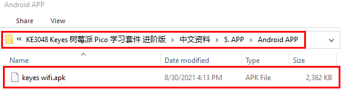

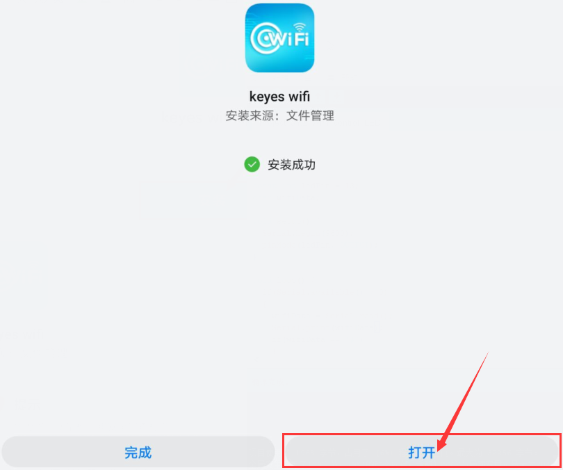

在WiFi按钮前面的文本框中输入检测到的WIFI IP地址（例如，上面串口监视器检测到的IP地址：192.168.0.119），再点击WIFI按钮，“403 Forbidden”或“网页无法打开”就会变成“192.168.0.119”。这样，就说明APP已经连接上了WiFi。

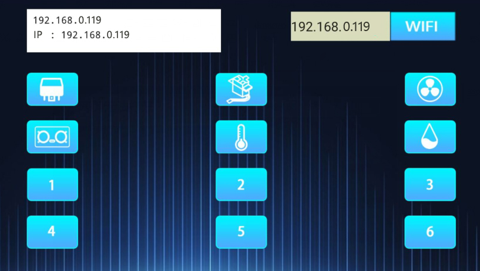

IOS系统设备（手机/iPad）APP

a.打开App Store。

b.在搜索框输入keyes link，点击搜索，出现下载界面，点击“”，就可以下载安装keyes link的APP。接下来的操作和安卓系统类似的，可以参考上面安卓系统的步骤进行操作。

注意：点击APP上的按钮，ESP8266串口WIFI ESP-01模块上的蓝色指示灯会闪烁，出现指示灯闪烁最亮的时候说明APP已经连接上WIFI。

APP已经连接上了WIFI后，开始进行如下操作：

点击按钮，继电器打开，APP上显示，模块上的指示灯点亮；再次点击按钮，继电器关闭，APP上显示，模块上的指示灯不亮。

点击按钮，舵机转动180°，APP上显示；再次点击按钮，APP上显示，舵机转动0°。

点击按钮，超声波传感器测距，在超声波传感器前放一个物体，APP上显示（不同的距离显示不同的数字），说明此时物体离超声波传感器的距离为14cm；再次点击按钮，关闭超声波，APP上显示。

点击按钮，温湿度传感器测量环境中的温度，APP上显示，说明此时环境中的温度为28℃；再次点击按钮，关闭温湿度传感器，APP上显示。

点击按钮，温湿度传感器测量环境中的湿度，APP上显示，说明此时环境中的湿度为52%；再次点击按钮，关闭温湿度传感器，APP上显示。
